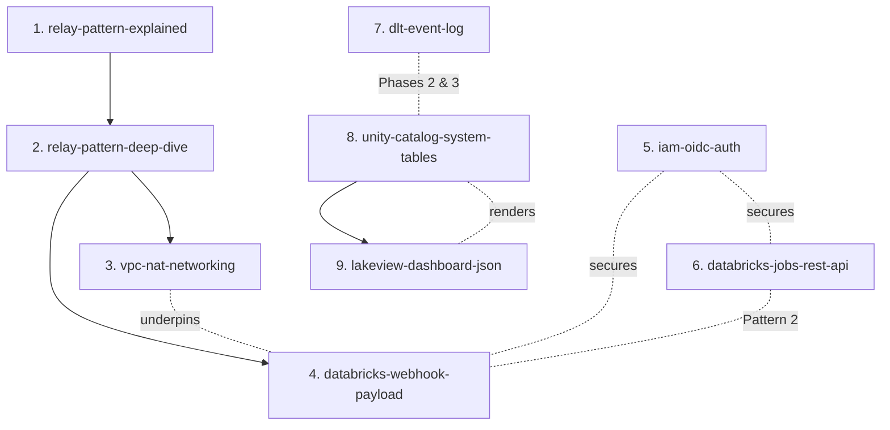

# Concepts — Learning Docs

Foundational explainers behind the observability program's infrastructure. Read in this
order for a complete, from-scratch understanding of the **relay pattern** (email +
Dynatrace) and the AWS networking it stands on.

## Reading path

| # | Doc | What it teaches | Depth |
|--:|-----|-----------------|-------|
| 1 | [relay-pattern-explained.md](relay-pattern-explained.md) | The concept: what a relay is, what DuoCircle is, why the shape exists | Intro |
| 2 | [relay-pattern-deep-dive.md](relay-pattern-deep-dive.md) | Every layer: protocols, AWS internals, real payloads, failure modes, cost, alternatives | Deep |
| 3 | [vpc-nat-networking-deep-dive.md](vpc-nat-networking-deep-dive.md) | The networking layer on its own — VPC/subnets/route tables/NAT/EIP/SG/VPC-endpoints, tied to this repo's `vpc.tf` | Deep |
| 4 | [databricks-webhook-payload-deep-dive.md](databricks-webhook-payload-deep-dive.md) | Exactly what Databricks webhooks send and how the relay maps it to Dynatrace | Deep |
| 5 | [iam-oidc-auth-deep-dive.md](iam-oidc-auth-deep-dive.md) | Federated auth: GitHub OIDC → AWS STS, SP OAuth, which token each pattern uses | Deep |
| 6 | [databricks-jobs-rest-api-deep-dive.md](databricks-jobs-rest-api-deep-dive.md) | The Jobs REST API + run-state model for Pattern 2 synthetic health checks | Deep |
| 7 | [dlt-event-log-deep-dive.md](dlt-event-log-deep-dive.md) | DLT event_log for pipeline health (Phase 2) & expectation metrics (Phase 3) | Deep |
| 8 | [unity-catalog-system-tables-deep-dive.md](unity-catalog-system-tables-deep-dive.md) | The `system.*` telemetry all dashboards read (billing/lakeflow/query/compute/access) | Deep |
| 9 | [lakeview-dashboard-json-deep-dive.md](lakeview-dashboard-json-deep-dive.md) | The `databricks_dashboard` serialized JSON structure — how to author dashboards | Deep |

**Grouping:**
- **Relay + infra path:** 1 → 2 → 3 → 4 (the DuoCircle/Dynatrace relay and its networking).
- **Auth:** 5 (underpins everything — CI deploys, provider auth, monitoring tokens).
- **Databricks telemetry sources:** 6 (Jobs API, for Pattern 2), 7 (event_log, for Phases 2/3), 8 (system tables, for Phases 0/2/4/8/9/10).
- **Building dashboards:** 9 (Lakeview JSON — how every dashboard phase is authored).

## How they connect

- **1 → 2:** concept, then full depth.
- **2 → 3:** the deep-dive references NAT/VPC; doc 3 is that networking in full, grounded
  in `vpc.tf` (2 AZs, single NAT, S3/STS/Kinesis VPC endpoints, self-referencing
  databricks-sg).
- **2 → 4:** the deep-dive shows the request lifecycle; doc 4 is the exact
  Databricks→Dynatrace payload translation, grounded in `edm_medallion.job.yml`.

## Why these exist

The Dynatrace failure-notification integration (Pattern 4) reuses the **exact same
architecture** as the existing DuoCircle email relay in
`terraform/.../scops-core/duocircle-relay.tf`. Understanding that one pattern — a relay
Lambda behind an API Gateway, egress pinned to a NAT's fixed IP — explains both, plus a
lot of how Databricks connectivity itself works. See
`../dynatrace/pattern-4-implementation-osdu-ssw-central-dbx.md` for the implementation
that builds on these concepts.
