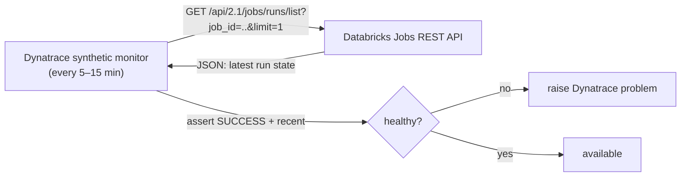
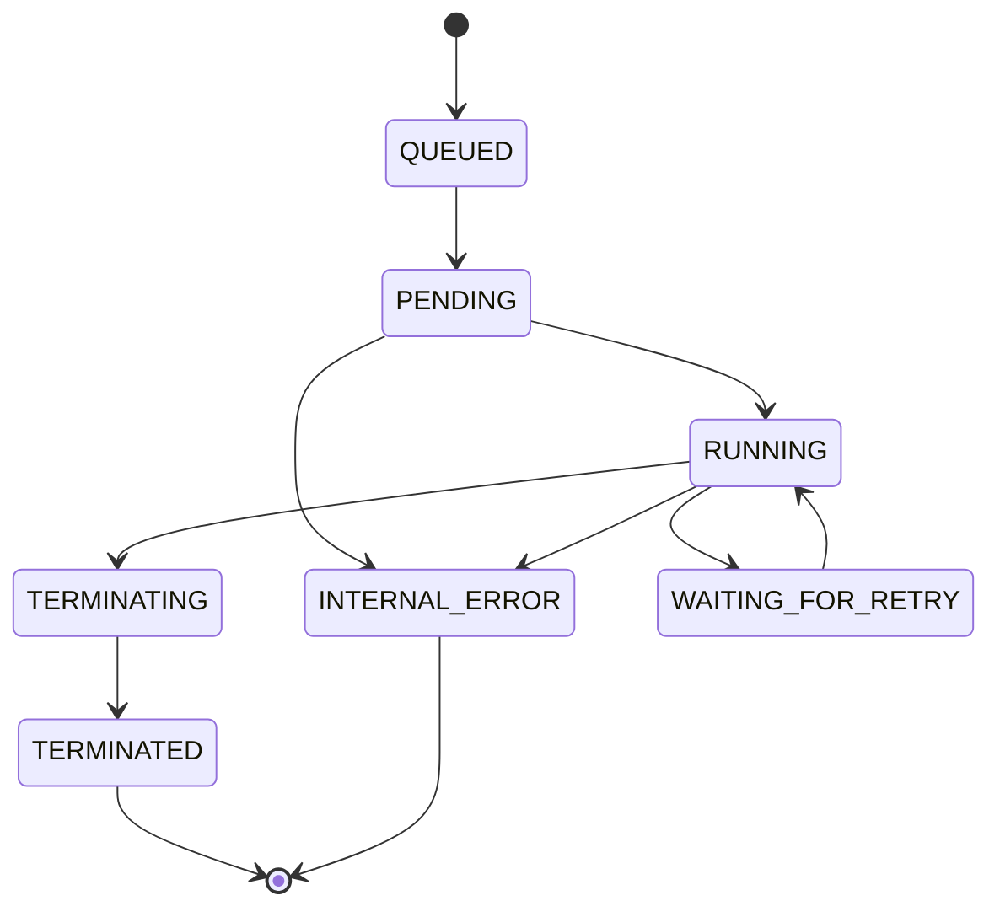
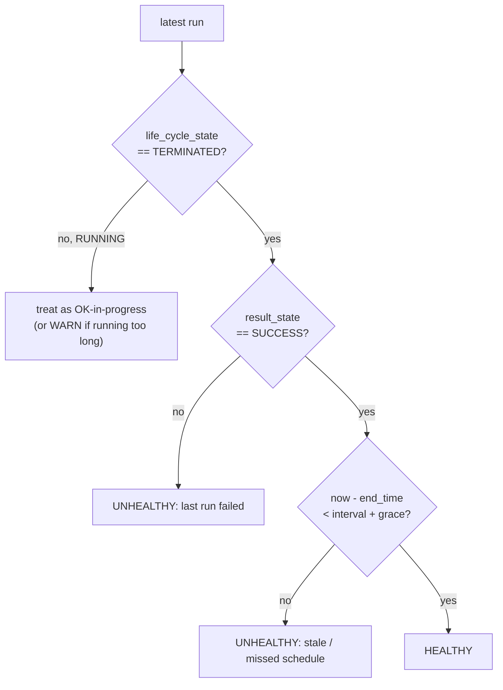

# Databricks Jobs REST API — Deep Dive (for Pattern 2 synthetic monitoring)

> How the Jobs REST API works, the run-state model, and how to turn it into a
> "health-check endpoint" that Dynatrace (or any synthetic monitor) can poll. Backs
> `../dynatrace/pattern-2-synthetic-monitor.md`.

**Contents**
1. Why the REST API is the "health endpoint" for batch jobs
2. API surface & versioning
3. Authentication
4. The run-state model (life_cycle_state vs result_state)
5. The endpoints you actually need
6. Real request/response examples
7. The two health assertions (succeeded + fresh)
8. Pagination & rate limits
9. Failure modes & gotchas
10. Glossary

---

## 1. Why the REST API is the "health endpoint" for batch jobs

A web service exposes `/healthz`; a **batch job doesn't** — it runs and exits. But the
**Jobs REST API** can report the state of a job's most recent run on demand, which is
functionally the same thing: *"is the latest run of job X healthy?"* A synthetic monitor
(Dynatrace Pattern 2) polls this and asserts health.



---

## 2. API surface & versioning

- Base: `https://<workspace-host>/api/2.1/jobs/...` (Jobs API **2.1** is current;
  2.0 is legacy).
- Host is the workspace URL, e.g.
  `https://shell-prj5642893-...-eu-west-1-prd.cloud.databricks.com`.
- All responses are JSON.

---

## 3. Authentication

Send a bearer token:

```
Authorization: Bearer <token>
```

Token options (see `iam-oidc-auth-deep-dive.md` for the full rationale):

| Option | Recommendation |
|--------|----------------|
| **Service principal OAuth token** (`CAN_VIEW` on jobs) | ✅ preferred for automation/monitoring |
| Scoped PAT on a low-priv service account | acceptable |
| A human's PAT | ❌ avoid |

For Pattern 2, the token lives in the **Dynatrace credential vault**, referenced by the
monitor — never inline.

---

## 4. The run-state model (the core concept)

A run has **two** state fields, and you must understand both:

### `life_cycle_state` — where the run is in its lifecycle



Common values: `QUEUED`, `PENDING`, `RUNNING`, `TERMINATING`, `TERMINATED`,
`INTERNAL_ERROR`, `SKIPPED`, `BLOCKED`, `WAITING_FOR_RETRY`.

### `result_state` — the outcome (only meaningful once `TERMINATED`)

| `result_state` | Meaning |
|----------------|---------|
| `SUCCESS` | ✅ ran and succeeded |
| `FAILED` | a task failed |
| `TIMEDOUT` | exceeded the timeout |
| `CANCELED` | cancelled by a user/system |
| `MAXIMUM_CONCURRENT_RUNS_REACHED` | skipped due to concurrency limit |

**Critical rule:** `result_state` is only valid when `life_cycle_state = TERMINATED`.
A `RUNNING` run has **no** `result_state` yet. So a health check must consider both:
*"is it TERMINATED, and if so is it SUCCESS?"* (and separately, "is a run even happening
on schedule?" — see §7).

---

## 5. The endpoints you actually need

| Endpoint | Purpose |
|----------|---------|
| `GET /api/2.1/jobs/list` | discover jobs → find the `job_id` (one-time) |
| `GET /api/2.1/jobs/runs/list?job_id={id}&limit=1` | latest run summary (the poll) |
| `GET /api/2.1/jobs/runs/get?run_id={id}` | full detail of one run (for drill-down) |
| `GET /api/2.1/jobs/get?job_id={id}` | job definition (schedule, tasks) |

For a synthetic health check, **`runs/list?job_id=…&limit=1`** is the one you poll.

---

## 6. Real request/response examples

### Poll the latest run

```
GET /api/2.1/jobs/runs/list?job_id=987654321&limit=1
Authorization: Bearer <token>
```

Response (trimmed):

```json
{
  "runs": [
    {
      "job_id": 987654321,
      "run_id": 5566778899,
      "state": {
        "life_cycle_state": "TERMINATED",
        "result_state": "SUCCESS",
        "state_message": ""
      },
      "start_time": 1730419200000,
      "end_time":   1730419812000,
      "run_page_url": "https://<host>/#job/987654321/run/5566778899"
    }
  ],
  "has_more": false
}
```

The monitor checks `runs[0].state.result_state == "SUCCESS"` and that
`end_time` is recent.

### A failing run looks like

```json
"state": {
  "life_cycle_state": "TERMINATED",
  "result_state": "FAILED",
  "state_message": "Task gold_well failed."
}
```

---

## 7. The two health assertions (both matter)

A naive check ("last run == SUCCESS") is **insufficient** — it stays green forever if the
scheduler stops firing. Assert **both**:



1. **Outcome:** `result_state == SUCCESS`.
2. **Freshness:** `now - end_time < expected_interval + grace`. This catches a job that
   silently *stopped being scheduled* — the failure mode a success-only check misses.

In the HTTP monitor, assertion 1 is a body pattern match
(`"result_state":"SUCCESS"`); assertion 2 needs arithmetic on `end_time` (a
browser-monitor JS step, or push the freshness as a metric via Pattern 3 and SLO on it).

---

## 8. Pagination & rate limits

- **Pagination:** `runs/list` returns `has_more` + supports `page_token` / `offset`. For
  a health check you only need `limit=1`, so pagination is moot.
- **Rate limits:** the Jobs API is rate-limited per workspace. Keep the poll interval
  sane (5–15 min, not every few seconds), especially if monitoring many jobs. Prefer one
  monitor per critical job over hammering the API.

---

## 9. Failure modes & gotchas

| Symptom | Cause | Fix |
|---------|-------|-----|
| Monitor green but job actually broken | checking only `result_state`, scheduler stopped | add the **freshness** assertion |
| 401/403 from the API | token expired / lacks `CAN_VIEW` | scoped SP token with view grant |
| Monitor can't reach the workspace | private workspace, public synthetic location | use a **private synthetic location / ActiveGate** in/peered to the VPC |
| `result_state` missing | run still `RUNNING` | only assert outcome when `TERMINATED` |
| Rate-limited (429) | polling too often / too many jobs | lengthen interval; fewer monitors |
| Wrong job matched | reused job name, wrong `job_id` | pin by numeric `job_id`, not name |

---

## 10. Glossary

| Term | Meaning |
|------|---------|
| **Jobs API 2.1** | current Databricks REST API for jobs/runs |
| **job_id** | stable numeric id of a job |
| **run_id** | id of a single execution of a job |
| **life_cycle_state** | where the run is (PENDING/RUNNING/TERMINATED/…) |
| **result_state** | the outcome once TERMINATED (SUCCESS/FAILED/…) |
| **state_message** | human-readable detail on the state |
| **start_time / end_time** | epoch **milliseconds** of run boundaries |
| **freshness check** | assert the last run is recent enough (catches missed schedules) |
| **synthetic monitor** | an external poller that turns the API into an uptime check |
| **private synthetic location** | a monitor run point inside your network (for private workspaces) |

---

## 11. One-breath summary

> A batch job has no `/healthz`, but `GET /api/2.1/jobs/runs/list?job_id=..&limit=1`
> reports its latest run, so a synthetic monitor can poll it. A run has **two** states:
> `life_cycle_state` (where it is) and `result_state` (the outcome, valid only when
> `TERMINATED`). A correct health check asserts **both** `result_state == SUCCESS` **and**
> that `end_time` is recent (freshness) — the latter catches a stopped scheduler that a
> success-only check would miss. Authenticate with a scoped read-only **service
> principal** token kept in Dynatrace's vault, poll every 5–15 min (respect rate limits),
> and use a **private synthetic location** if the workspace isn't publicly reachable.
