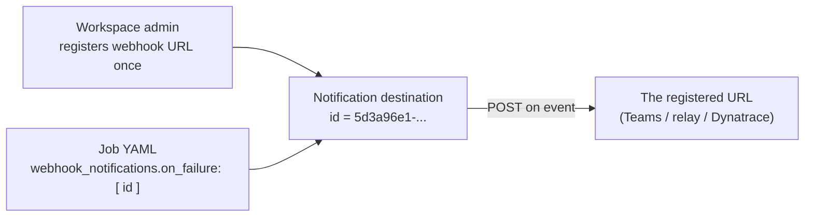
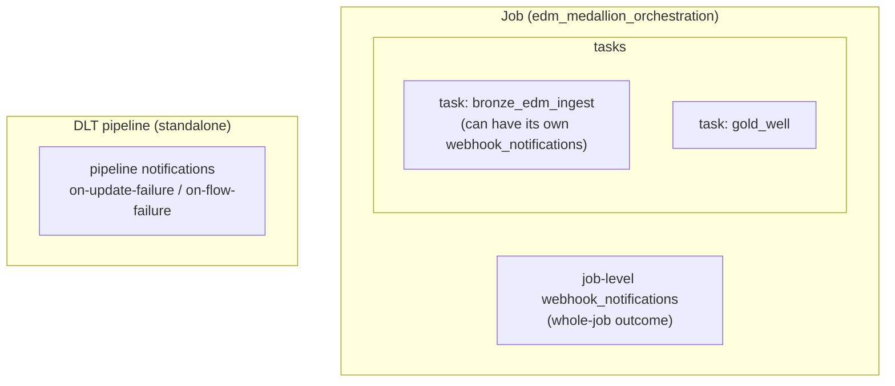
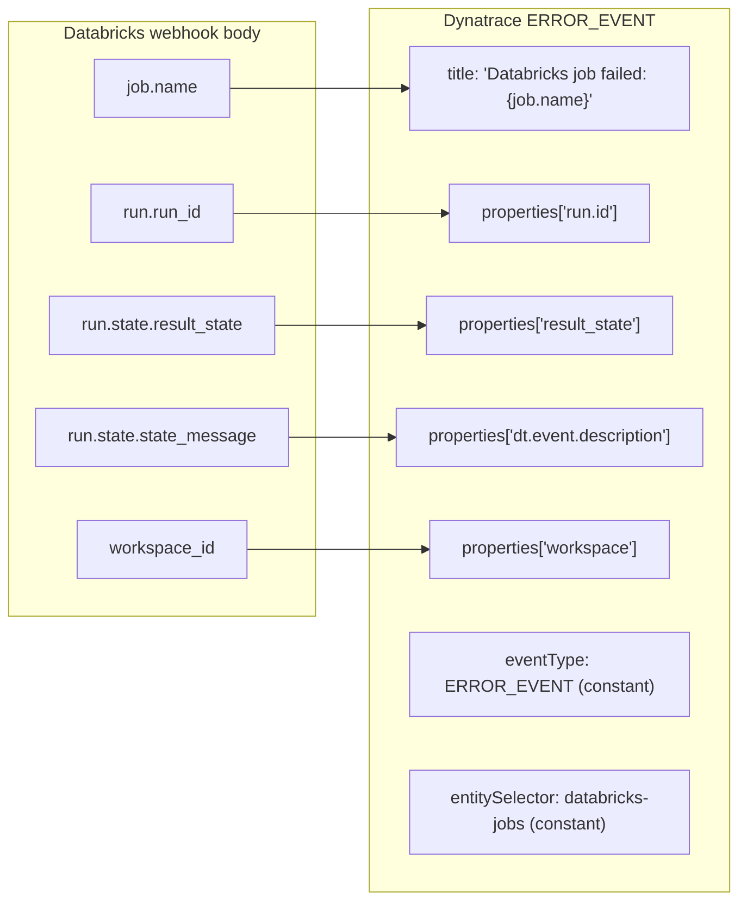
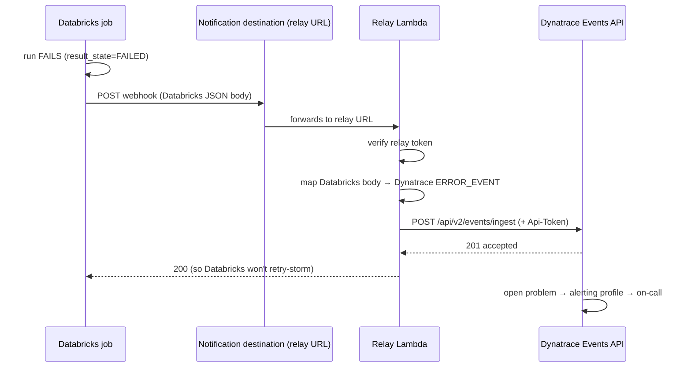

# Databricks Webhook Notifications & Payload Format — Deep Dive

> Everything about how Databricks job/pipeline notifications work, what the webhook
> **actually sends**, and how the relay maps it to Dynatrace. Grounded in this estate's
> `resources/edm_medallion.job.yml` (the medallion orchestration job).

**Contents**
1. The two notification channels (email vs webhook)
2. Notification destinations — the registration model
3. Trigger types (on_start / on_success / on_failure / on_duration_warning)
4. Where notifications attach (job-level vs task-level vs DLT pipeline)
5. The actual webhook payload Databricks sends
6. What Dynatrace expects (and why they don't match)
7. The mapping, field by field
8. End-to-end flow
9. Gotchas & edge cases
10. Verification

---

## 1. The two notification channels

Databricks jobs can notify on lifecycle events via two mechanisms — your medallion job
already uses **both**:

```yaml
# resources/edm_medallion.job.yml (existing)
email_notifications:
  on_failure: ${var.medallion_notification_emails}
webhook_notifications:
  on_failure:
    - id: ${var.webhook_destination_id}
```

| Channel | What it does | Configurable body? |
|---------|--------------|--------------------|
| `email_notifications` | Databricks sends a formatted email directly | No |
| `webhook_notifications` | Databricks POSTs a JSON payload to a **registered destination URL** | No (fixed Databricks schema) |

The webhook channel is the one we care about for Dynatrace — it lets an external system
react programmatically. **But** you can't point it at an arbitrary URL inline, and you
can't customise the body — which is exactly why the relay exists (see §6–7).

---

## 2. Notification destinations — the registration model

A crucial detail: `webhook_notifications` references a destination by **`id`**, not a
URL:

```yaml
webhook_notifications:
  on_failure:
    - id: ${var.webhook_destination_id}   # e.g. 5d3a96e1-52d4-4a71-aa87-4bf29d064fff
```

That `id` is a **notification destination** — a webhook URL **pre-registered by a
workspace admin** (Settings → Notifications → Notification destinations). You register
the URL once, Databricks gives you a UUID, and jobs reference the UUID.



**Implications:**
- You **cannot** add an `Authorization` header or change the body from the job — the
  destination is just a URL Databricks owns the request to.
- Registering a destination is a **manual admin step**, not managed by the DAB bundle.
- This is precisely why hitting Dynatrace (which needs an `Api-Token` header + a specific
  body) requires a **relay** in between.

The existing `5d3a96e1-...` destination is the **Teams** webhook; the Dynatrace relay
gets its **own** destination id alongside it.

---

## 3. Trigger types

`webhook_notifications` (and `email_notifications`) support these event triggers:

| Trigger | Fires when | Typical use |
|---------|-----------|-------------|
| `on_start` | run begins | audit / "it started" |
| `on_success` | run finishes SUCCESS | downstream kick-off |
| `on_failure` | run finishes FAILED/ERROR/TIMEDOUT | **alerting** (what we use) |
| `on_duration_warning` | run exceeds an expected-duration threshold | SLA early-warning |

For Dynatrace paging we wire **`on_failure`**. You could also wire
`on_duration_warning` to raise a Dynatrace *warning* event for the SLO story (Phase 5).

DLT **pipelines** use different trigger names (`on-update-failure`,
`on-update-fatal-failure`, `on-flow-failure`) — see Phase 1 docs. Those are pipeline
notifications, separate from job webhook_notifications.

---

## 4. Where notifications attach

Three distinct places, easy to confuse:



| Level | Fires for | This estate |
|-------|-----------|-------------|
| **Job-level** `webhook_notifications` | the overall job run outcome | ✅ used on the medallion job |
| **Task-level** `webhook_notifications` | a specific task's outcome | optional, finer-grained |
| **DLT pipeline** `notifications` | a standalone pipeline update | Phase 1 adds these (email) |

For Dynatrace Pattern 4 we use **job-level `on_failure`** on the medallion job — one
signal for "the medallion failed."

---

## 5. The actual webhook payload Databricks sends

When a job webhook fires, Databricks POSTs a JSON body to the destination URL. The shape
(fields present depend on the event) looks like:

```json
{
  "workspace_id": 123456789,
  "job": {
    "id": 987654321,
    "name": "edm_medallion_orchestration"
  },
  "run": {
    "run_id": 5566778899,
    "number_in_job": 42,
    "state": {
      "life_cycle_state": "TERMINATED",
      "result_state": "FAILED",
      "state_message": "Task gold_well failed."
    },
    "start_time": 1730419200000,
    "end_time":   1730419812000
  },
  "event_type": "JOB_RUN_FAILED"
}
```

Key fields the relay cares about:

| Field | Meaning |
|-------|---------|
| `job.name` | the job that failed |
| `run.run_id` | the specific run (for drill-down links) |
| `run.state.result_state` | `FAILED` / `TIMEDOUT` / `CANCELED` |
| `run.state.state_message` | human-readable failure reason |
| `workspace_id` | which workspace (env/region context) |

> **Important:** the exact field names/nesting vary by Databricks version and event type.
> The relay Lambda parses **defensively** (tries multiple shapes, falls back to
> "unknown") so a schema tweak doesn't break alerting. This is why the relay code uses
> `payload.get("job", {}).get("name") or payload.get("job_name") or "unknown-job"`.

---

## 6. What Dynatrace expects (and why they don't match)

Dynatrace **Events API v2** expects a *different* JSON shape, a specific endpoint, and an
auth header:

```json
POST https://<tenant>/api/v2/events/ingest
Authorization: Api-Token dt0c01.XXXX        // <-- Databricks can't add this
Content-Type: application/json

{
  "eventType": "ERROR_EVENT",               // <-- Databricks doesn't emit this field
  "title": "...",
  "entitySelector": "type(CUSTOM_DEVICE),entityName(databricks-jobs)",
  "properties": { "dt.event.description": "...", "job.name": "...", ... }
}
```

The two **don't line up**:

| Concern | Databricks webhook | Dynatrace Events API |
|---------|--------------------|-----------------------|
| Auth header | none (you can't add one) | `Authorization: Api-Token …` required |
| Body shape | `job`/`run`/`state` nesting | `eventType`/`title`/`properties` |
| Endpoint | whatever URL you registered | `/api/v2/events/ingest` |

→ **This mismatch is the entire justification for the relay.** Something must add the
token and translate the body. That "something" is the relay Lambda.

---

## 7. The mapping, field by field

The relay's job is this translation:



In code (the relay Lambda), that's:

```python
job_name = payload.get("job", {}).get("name") or payload.get("job_name") or "unknown-job"
run_id   = str(payload.get("run", {}).get("run_id") or payload.get("run_id") or "")
state    = payload.get("run", {}).get("state", {}).get("result_state") or "FAILED"

body = {
    "eventType": "ERROR_EVENT",
    "title": f"Databricks job failed: {job_name}",
    "entitySelector": "type(CUSTOM_DEVICE),entityName(databricks-jobs)",
    "properties": {
        "dt.event.description": f"Run {run_id} of {job_name} {state}",
        "job.name": job_name,
        "run.id": run_id,
        "result_state": state,
    },
}
```

Plus it injects the `Authorization: Api-Token …` header that Databricks couldn't.

---

## 8. End-to-end flow



---

## 9. Gotchas & edge cases

- **Payload varies by version/event** — parse defensively; never assume a single exact
  shape. The relay falls back to `"unknown"` rather than 500-ing.
- **Retries / flapping** — a job that auto-retries can fire multiple `on_failure`
  webhooks. Configure the Dynatrace **alerting profile to de-duplicate**, and prefer
  alerting on *fatal* (no-retries-left) where the signal exists, so one incident isn't
  100 problems.
- **Success shouldn't alert** — only `on_failure` is wired; a green run sends nothing.
- **Destination is admin-managed** — registering the relay URL as a notification
  destination is a one-time manual admin action per workspace, outside the DAB bundle.
- **Timestamps are epoch milliseconds** — if you forward `start_time`/`end_time` into
  Dynatrace properties, keep them as-is (ms) or convert deliberately.
- **Two destinations, not one** — keep the existing Teams destination *and* add the
  Dynatrace relay destination; the job lists both under `on_failure`.
- **Task vs job level** — job-level fires once for the whole medallion; if you want
  per-domain granularity (which gold failed), attach task-level webhooks too.

---

## 10. Verification

1. **Registration** — confirm the relay URL is registered as a notification destination
   and you have its UUID.
2. **Wiring** — `bundle validate` passes with both destinations under `on_failure`.
3. **Forced failure** — run a dev job that fails → confirm:
   - the relay Lambda logs the received Databricks body,
   - a Dynatrace `ERROR_EVENT` appears within seconds,
   - the Teams message still arrives too (both destinations fired).
4. **Success negative test** — a passing run produces **no** Dynatrace event.
5. **Malformed-body test** — post a truncated body to the relay → it still returns 200
   and emits a best-effort event, not a 500.

---

## 11. One-breath summary

> Databricks job `webhook_notifications` POST a **fixed, Databricks-shaped JSON body** to
> a **pre-registered destination** (referenced by UUID, not URL) on events like
> `on_failure` — and you **can't** add an auth header or change the body. Dynatrace's
> Events API needs a **different body** and an **`Api-Token` header**, so a **relay**
> sits between them: it verifies a shared token, **maps** `job`/`run`/`state` fields into
> a Dynatrace `ERROR_EVENT`, injects the token, forwards to `/api/v2/events/ingest`, and
> returns 200 so Databricks doesn't retry-storm. Wire it as a **second** `on_failure`
> destination alongside the existing Teams one; parse defensively; de-dup retries; only
> failures alert.
