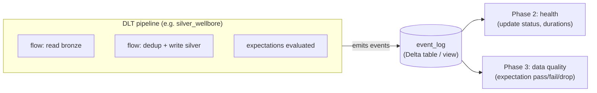
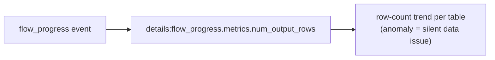
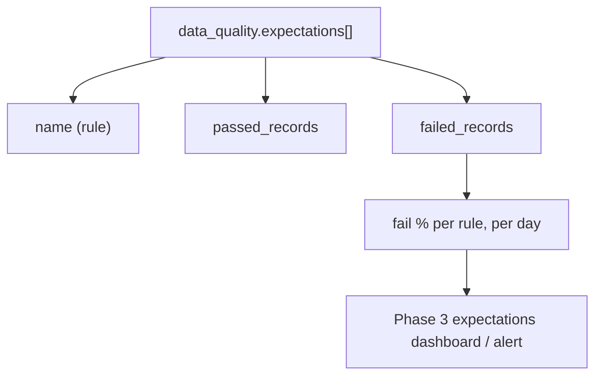

# DLT / Lakeflow Pipeline `event_log` — Deep Dive (for Phases 2 & 3)

> How Delta Live Tables (DLT / Lakeflow Declarative Pipelines) emit an **event log**,
> what's inside it, and how to query it for pipeline health (Phase 2) and data-quality
> expectation metrics (Phase 3). Grounded in this estate's `resources/*pipeline*.yml`
> (18 DLT pipelines, `serverless: true`, medallion bronze→silver→gold).

**Contents**
1. What the event_log is
2. How to access it (three ways)
3. The row shape (the important columns)
4. Event types you care about
5. The `details` JSON — where the real data lives
6. Flow progress & metrics (row counts, backpressure)
7. Data-quality expectations (the Phase 3 goldmine)
8. Update/pipeline status (the Phase 2 signal)
9. Ready-to-use queries
10. Failure modes & gotchas
11. Glossary

---

## 1. What the event_log is

Every DLT pipeline continuously emits structured **events** — "this flow started,"
"this table wrote N rows," "this expectation dropped M rows," "this update completed/
failed." Databricks persists them as a queryable **event log**. It's the pipeline's
**black-box recorder**: everything about a run's health and data quality is in there.



---

## 2. How to access it (three ways)

| Access method | How | When |
|---------------|-----|------|
| **Table-valued function** | `SELECT * FROM event_log(TABLE(<catalog.schema.table_or_pipeline>))` | ad-hoc, any UC-published pipeline table |
| **Published event_log table** | set the pipeline to publish its event log to a named UC table, then `SELECT * FROM <catalog.schema.event_log_table>` | durable dashboards/alerts |
| **system.lakeflow** | `system.lakeflow.*` pipeline views (where available) | cross-pipeline, estate-wide |

> In this estate, confirm which is enabled. For durable Lakeview dashboards (Phase 2/3),
> **publishing the event log to a UC table** is the most robust — you get a stable
> `catalog.schema.table` to query with the existing `databricks_dashboard` pattern.
> Substitute your accessor for `${event_log_source}` in the queries below.

---

## 3. The row shape (the important columns)

Each event is a row. The columns that matter:

| Column | What it holds |
|--------|---------------|
| `id` | unique event id |
| `timestamp` | when the event happened |
| `event_type` | the kind of event (see §4) |
| `message` | human-readable summary |
| `level` | `INFO` / `WARN` / `ERROR` |
| `origin` | struct: pipeline_id, update_id, flow_name, etc. |
| `details` | **JSON** with the structured payload — the real data (see §5) |

The `details` column is a JSON/variant string you navigate with the `:` operator
(`details:flow_progress.status`).

---

## 4. Event types you care about

| `event_type` | Tells you | Used by |
|--------------|-----------|---------|
| `update_progress` | overall pipeline update state (RUNNING/COMPLETED/FAILED) | **Phase 2** |
| `flow_progress` | per-flow (per-table) progress, metrics, **data quality** | **Phase 2 & 3** |
| `flow_definition` | a flow's schema/definition | lineage/debug |
| `dataset_definition` | table/view definitions | debug |
| `maintenance_progress` | OPTIMIZE/VACUUM on pipeline tables | Phase 10 overlap |
| `user_action` | start/stop by a user | audit |

The two workhorses are **`update_progress`** (did the run succeed?) and
**`flow_progress`** (per-table row counts + expectations).

---

## 5. The `details` JSON — where the real data lives

The shape of `details` depends on `event_type`. Key paths:

```
details:update_progress.state                      -- COMPLETED / FAILED / RUNNING / CANCELED
details:flow_progress.status                        -- COMPLETED / RUNNING / FAILED
details:flow_progress.metrics.num_output_rows       -- rows written by this flow
details:flow_progress.data_quality.expectations     -- array of expectation results
details:flow_progress.data_quality.dropped_records  -- rows dropped by expect_or_drop
```

You extract them with `FROM_JSON` / the `:` accessor (Spark SQL), as in the queries
below.

---

## 6. Flow progress & metrics (row counts, backpressure)

`flow_progress` events carry **per-flow metrics** — most usefully
`num_output_rows` (how many rows a table produced in this update). Trending this catches
silent data loss (a table that suddenly writes 10% of usual volume) even when the
pipeline "succeeds."



---

## 7. Data-quality expectations (the Phase 3 goldmine)

When a flow has `@dlt.expect*` rules, each `flow_progress` event includes their results
under `data_quality.expectations` — an array of:

```json
{
  "name": "md_non_negative",
  "dataset": "silver_trajectory",
  "passed_records": 1543000,
  "failed_records": 221
}
```

This is exactly what Phase 3's expectations dashboard reads. `passed_records` /
`failed_records` per expectation, per update, gives you pass-rate and trend. `expect_or_drop`
rules also populate `dropped_records`.



---

## 8. Update/pipeline status (the Phase 2 signal)

`update_progress` events report the **overall update outcome**:

```
details:update_progress.state ∈ { INITIALIZING, SETTING_UP_TABLES, RUNNING,
                                   COMPLETED, FAILED, CANCELED }
```

The most recent `update_progress` with a terminal `state` = "did the last pipeline run
succeed?" — the standalone-pipeline equivalent of the job health signal in Phase 2
(useful because these DLT pipelines can run standalone, outside the orchestration job).

---

## 9. Ready-to-use queries

> Replace `${event_log_source}` with your accessor: either
> `event_log(TABLE('<pipeline_id_or_table>'))` or a published event-log table name.

### Latest update status (Phase 2)

```sql
SELECT
  origin.update_id,
  details:update_progress.state AS update_state,
  timestamp
FROM ${event_log_source}
WHERE event_type = 'update_progress'
  AND details:update_progress.state IN ('COMPLETED','FAILED','CANCELED')
ORDER BY timestamp DESC
LIMIT 1;
```

### Per-table row counts for the latest update (Phase 2)

```sql
SELECT
  origin.flow_name AS table_name,
  MAX(CAST(details:flow_progress.metrics.num_output_rows AS BIGINT)) AS rows_written,
  MAX(timestamp) AS at
FROM ${event_log_source}
WHERE event_type = 'flow_progress'
  AND details:flow_progress.metrics.num_output_rows IS NOT NULL
GROUP BY origin.flow_name
ORDER BY table_name;
```

### Expectation pass/fail per rule (Phase 3)

```sql
WITH exp AS (
  SELECT
    timestamp,
    origin.flow_name AS table_name,
    EXPLODE(FROM_JSON(
      details:flow_progress.data_quality.expectations,
      'array<struct<name:string,dataset:string,passed_records:bigint,failed_records:bigint>>'
    )) AS e
  FROM ${event_log_source}
  WHERE event_type = 'flow_progress'
    AND details:flow_progress.data_quality IS NOT NULL
    AND timestamp >= CURRENT_DATE - INTERVAL 7 DAYS
)
SELECT
  table_name,
  e.name AS expectation,
  SUM(e.passed_records) AS passed,
  SUM(e.failed_records) AS failed,
  ROUND(100.0 * SUM(e.failed_records)
        / NULLIF(SUM(e.passed_records + e.failed_records),0), 2) AS fail_pct
FROM exp
GROUP BY table_name, e.name
ORDER BY fail_pct DESC, failed DESC;
```

(These mirror the SQL already staged in `implementations/phase-02-job-health/` and
`implementations/phase-03-data-quality/expectation_metrics.sql`.)

---

## 10. Failure modes & gotchas

| Symptom | Cause | Fix |
|---------|-------|-----|
| `event_log(...)` returns nothing | wrong accessor / pipeline id, or not published | confirm the pipeline id / published table |
| `data_quality` path is null | the flow has **no expectations** defined | add `@dlt.expect*` (Phase 3, DE-owned) |
| JSON parse errors | `details` schema varies by runtime | parse defensively; confirm paths per DBR version |
| Only see one update | event log retention / you queried a single update TVF | publish to a durable table for history |
| Row counts look low | genuine data issue OR incremental update | compare to baseline; check update type (full vs incremental) |
| Can't build a dashboard on it | TVF not directly dashboardable | **publish** the event log to a UC table, then dashboard that |

---

## 11. Glossary

| Term | Meaning |
|------|---------|
| **DLT / Lakeflow pipeline** | declarative Databricks pipeline (bronze/silver/gold here) |
| **event_log** | the queryable stream of a pipeline's structured events |
| **flow** | a single table/dataset computation within a pipeline |
| **update** | one execution of a pipeline (like a "run") |
| **event_type** | the category of an event (update_progress, flow_progress, …) |
| **details** | the JSON payload of an event (navigated with `:`) |
| **flow_progress** | per-table event with metrics + data quality |
| **update_progress** | overall pipeline-update-state event |
| **expectation** | a `@dlt.expect*` data-quality rule |
| **passed/failed/dropped_records** | expectation outcome counts |
| **num_output_rows** | rows a flow wrote in an update |
| **published event log** | event log written to a named UC table for durable querying |

---

## 12. One-breath summary

> Every DLT pipeline emits a structured **event_log** — its black-box recorder. Query it
> via a table-valued function, a **published UC table** (best for durable dashboards), or
> `system.lakeflow`. Each row has an `event_type` and a JSON `details`; the two you care
> about are **`update_progress`** (did the run succeed? → Phase 2) and **`flow_progress`**
> (per-table `num_output_rows` and, when expectations exist,
> `data_quality.expectations[]` with `passed/failed/dropped_records` → Phase 3). Parse
> `details` defensively, publish the log to a UC table so you can build Lakeview
> dashboards/alerts on it, and remember `data_quality` is only populated where
> data-engineering has defined `@dlt.expect*` rules.
