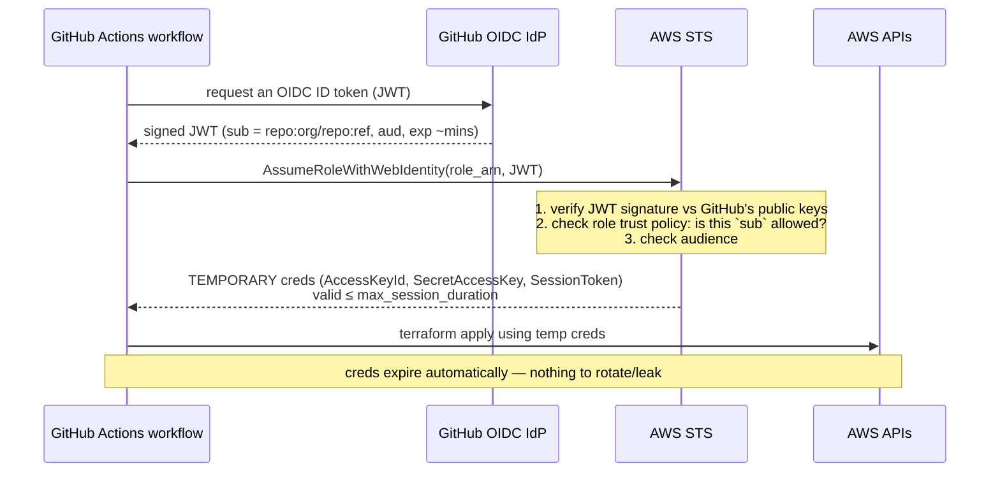
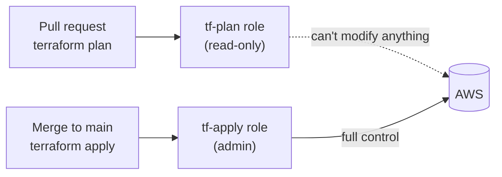
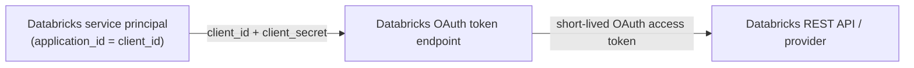

# IAM, OIDC & Federated Auth — Deep Dive (grounded in this repo)

> How authentication works across this platform **without long-lived secrets** — from
> GitHub Actions deploying Terraform, to the Databricks provider, to the tokens the
> observability integrations (Dynatrace Patterns 2/3/4) should use. Grounded in the
> repo's `scops-base/repo-config-infra-oidc.tf` and `service-principals/`.

**Contents**
1. The problem: why long-lived keys are dangerous
2. The idea: federated identity (prove *who you are*, get a short-lived token)
3. OIDC in one paragraph
4. GitHub Actions → AWS STS (the repo's CI auth), step by step
5. The trust policy — `subjects` scoping (the security-critical bit)
6. Least privilege: the apply vs plan role split
7. Temporary credentials & session duration
8. Databricks side: service-principal OAuth (M2M)
9. Which token each observability pattern should use
10. Failure modes & gotchas
11. Glossary

---

## 1. The problem: long-lived keys are dangerous

The old way to let CI deploy to AWS was to store an **access key + secret** (`AKIA…`) as
a secret in GitHub. Problems:

- **They don't expire** — if leaked (logs, a compromised action, a screenshot), they
  work until someone notices and rotates them.
- **They're copied around** — every repo/pipeline that needs AWS holds a copy.
- **Rotation is manual and forgotten.**
- **Blast radius** — one leaked admin key = full account compromise.

The whole point of OIDC federation is to **eliminate the stored secret entirely**.

---

## 2. The idea: federated identity

Instead of "here's a secret only we both know," federation says:

> "I'll **prove who I am** with a short-lived, cryptographically-signed identity token
> from a provider you already trust, and you'll give me **temporary** credentials scoped
> to exactly what I need."

No standing secret exists to leak. The identity token lives for minutes; the AWS
credentials it's exchanged for live for hours at most.

---

## 3. OIDC in one paragraph

**OIDC (OpenID Connect)** is an identity layer on top of OAuth 2.0. An **identity
provider (IdP)** — here, GitHub — issues a signed **ID token (JWT)** asserting facts
("this workflow run is from org `X`, repo `Y`, branch `Z`"). A **relying party** — here,
AWS — is configured to **trust** that IdP and to accept its tokens, verifying the
signature against the IdP's published public keys. AWS then hands back temporary
credentials. The trust is established once (an **OIDC provider** resource); no secrets
are exchanged per run.

---

## 4. GitHub Actions → AWS STS — the repo's CI auth

This repo sets it up with two modules:

- `iam_github_oidc_provider` (in the `global` stack) — registers GitHub as a trusted
  OIDC provider in the AWS account (once).
- `gh_oidc_role_infra_tf_apply` / `gh_oidc_role_infra_tf_plan` (in each `scops-base`) —
  IAM **roles** GitHub Actions can assume via that provider.

The flow when a GitHub Actions workflow runs `terraform apply`:



No `AKIA…` secret anywhere. The only thing stored in GitHub is the **role ARN** (not
sensitive) — surfaced in the repo as `IAM_ROLE_TF_APPLY` (see
`scops-base/repo-config-infra.tf`).

---

## 5. The trust policy — `subjects` scoping (the security-critical bit)

An IAM role that trusts GitHub OIDC is only as safe as **which GitHub identities it lets
assume it**. That's the `subjects` in the module:

```hcl
module "gh_oidc_role_infra_tf_apply" {
  source = "terraform-aws-modules/iam/aws//modules/iam-github-oidc-role"
  # ...
  subjects = [
    format("%s/%s:*", local.gh_org_name, local.gh_infra_repo),  # org/repo:*
  ]
}
```

That `org/repo:*` becomes a condition on the JWT's **`sub`** claim in the role's trust
policy. It means *"only workflow runs from **this specific org + repo** may assume this
role."* Critical points:

- **Scope it tightly.** `org/repo:*` = any branch/ref in that repo. To lock further, you
  can require a specific branch/environment (`repo:org/repo:ref:refs/heads/main`) or a
  GitHub **environment** (`repo:org/repo:environment:prod`). Loose subjects (e.g. `*`)
  would let *any* repo mint your credentials — a classic misconfiguration.
- **Audience (`aud`)** is also checked (usually `sts.amazonaws.com`) to prevent token
  reuse against a different service.

This trust policy is the entire security boundary of the OIDC approach — get the
`subjects` right and there's no secret to steal; get it wrong (too broad) and you've
opened the account.

---

## 6. Least privilege: apply vs plan role split

The repo deliberately uses **two** roles, which is a best practice worth calling out:

| Role | Policy | Used by | Why |
|------|--------|---------|-----|
| `…-role-tf-apply` | `AdministratorAccess` | `terraform apply` (merge to main) | apply genuinely needs to create/modify anything |
| `…-role-tf-plan` | read-only (`ReadAccess` + awscc read) | `terraform plan` (PRs) | plan only needs to *read* current state to compute a diff |



**Why it matters:** PRs from forks/contributors run `plan`; giving that path only
read-only credentials means a malicious PR can't use the plan step to mutate infra. The
powerful admin role is reserved for the trusted, post-merge apply. This is the principle
of least privilege applied to CI.

---

## 7. Temporary credentials & session duration

`max_session_duration = 10800` (3 hours) caps how long the assumed-role credentials are
valid. After that the workflow must re-assume (get a fresh JWT → fresh creds). Shorter is
safer (smaller leak window); it just has to comfortably exceed your longest
apply/plan run. Temporary credentials are the **whole value proposition** — even if
captured, they're useless within hours and are scoped to the role's policy.

---

## 8. Databricks side: service-principal OAuth (M2M)

Auth to **Databricks** (for the Terraform databricks provider, the DAB `run_as`, and any
programmatic API access) uses a **service principal** with **OAuth machine-to-machine
(M2M)** credentials, not a personal token. In the repo:

- `service-principals/` creates `databricks_service_principal` resources; each has an
  **`application_id`** — this *is* the OAuth **`client_id`**.
- The databricks provider authenticates with `client_id` + `client_secret` (M2M OAuth),
  e.g. `service-principals/providers.tf` uses `client_id = var.databricks_client_id`.
- The DAB bundle runs pipelines as a shared SP (`run_as.service_principal_name`).



**Why service principal over PAT (personal access token):**
- Not tied to a leaving employee's identity.
- OAuth M2M tokens are **short-lived** and auto-refreshed (vs a PAT that's long-lived).
- Scoped, auditable machine identity.

This is the same "short-lived token from a trusted identity" philosophy as the AWS OIDC
side, applied to Databricks.

---

## 9. Which token each observability pattern should use

Direct, practical guidance for the Dynatrace/observability work:

| Integration | Auth to use | Why |
|-------------|-------------|-----|
| **Pattern 2** (Dynatrace polls Databricks Jobs API) | a **service principal** with `CAN_VIEW` on the target jobs, OAuth M2M (or a scoped PAT on a low-priv service account) | least-privilege, read-only, not a human PAT; store in Dynatrace credential vault |
| **Pattern 3** (Databricks pushes metrics to Dynatrace) | Dynatrace API token (`metrics.ingest`) in a **Databricks secret scope** | token stays server-side, read via `dbutils.secrets.get` |
| **Pattern 4** (relay → Dynatrace events) | Dynatrace API token (`events.ingest`) in the **Lambda env / Secrets Manager** | token off Databricks entirely; relay holds it |
| **Terraform (dashboards/alerts)** | the databricks provider's SP OAuth (existing) | consistent with repo; no PAT in state |
| **CI deploying any of the above** | the existing **GitHub OIDC apply role** | no stored AWS keys |

**Rule of thumb:** never a personal PAT for automation; prefer OAuth service principals
(Databricks) and OIDC roles (AWS); store third-party tokens in a secret scope / Secrets
Manager, never in git.

---

## 10. Failure modes & gotchas

| Symptom | Cause | Fix |
|---------|-------|-----|
| `Not authorized to perform sts:AssumeRoleWithWebIdentity` | trust policy `subjects` don't match the workflow's `sub` | align `subjects` to `org/repo[:ref/environment]` |
| Any repo can assume the role | `subjects` too broad (`*`) | tighten to the exact org/repo |
| Creds expire mid-apply | `max_session_duration` too short | raise it above the longest run (still keep modest) |
| Databricks 403 from automation | using a PAT that expired / SP lacks grant | use SP OAuth; grant least-priv `CAN_VIEW`/`CAN_USE` |
| Token leaked in logs | printing secrets | never echo tokens; mark TF vars `sensitive`; use secret scopes |
| Dynatrace rejects Databricks API poll | wrong/over-scoped credential in vault | scoped read-only SP token; rotate |

---

## 11. Glossary

| Term | Meaning |
|------|---------|
| **IAM** | AWS Identity and Access Management — users, roles, policies |
| **IAM role** | an assumable identity with a policy; no long-term credentials of its own |
| **Trust policy** | who/what is allowed to assume a role |
| **Permission policy** | what an assumed role can do |
| **OIDC** | OpenID Connect — identity layer over OAuth 2.0 |
| **IdP (Identity Provider)** | issues signed identity tokens (here: GitHub) |
| **JWT** | JSON Web Token — the signed identity assertion |
| **`sub` claim** | the subject of the JWT (here: `repo:org/repo:ref`) |
| **`aud` claim** | intended audience of the token (here: `sts.amazonaws.com`) |
| **STS** | AWS Security Token Service — issues temporary credentials |
| **AssumeRoleWithWebIdentity** | STS call that exchanges an OIDC JWT for temp creds |
| **Temporary credentials** | short-lived AccessKey/Secret/SessionToken |
| **Service principal** | a non-human (machine) identity in Databricks |
| **OAuth M2M** | machine-to-machine OAuth: client_id + client_secret → short-lived token |
| **PAT** | Personal Access Token — long-lived, tied to a user (avoid for automation) |
| **`application_id`** | the Databricks SP's OAuth `client_id` |

---

## 12. One-breath summary

> Long-lived AWS keys are a liability, so this repo uses **OIDC federation**: GitHub
> Actions proves its identity with a short-lived signed **JWT**, and AWS **STS** exchanges
> it (via `AssumeRoleWithWebIdentity`) for **temporary** credentials — nothing stored, so
> nothing to leak. The role's **trust policy `subjects`** (`org/repo:*`) is the security
> boundary, and the repo splits a read-only **plan** role from an admin **apply** role for
> least privilege. On the Databricks side, automation uses **service-principal OAuth M2M**
> (the SP's `application_id` = `client_id`) rather than personal PATs. For the
> observability integrations, use a scoped read-only SP for Pattern 2, and keep Dynatrace
> tokens in a **secret scope** (Pattern 3) or the **relay's env/Secrets Manager**
> (Pattern 4) — never a human PAT, never in git.
