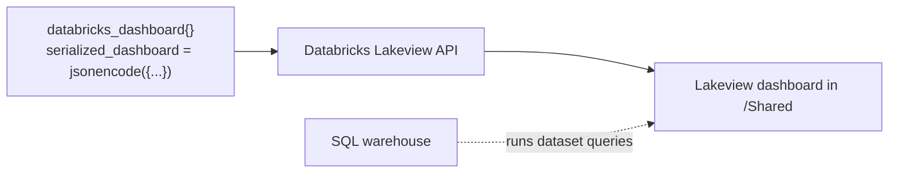
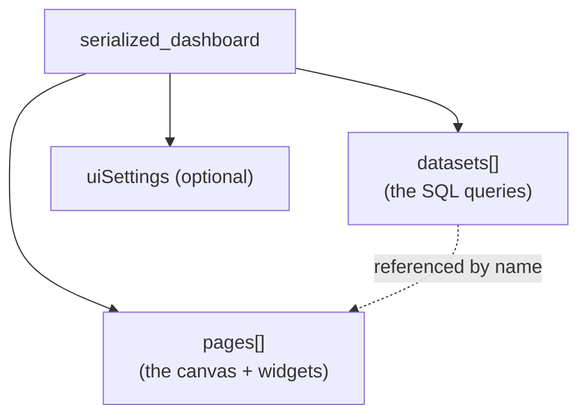
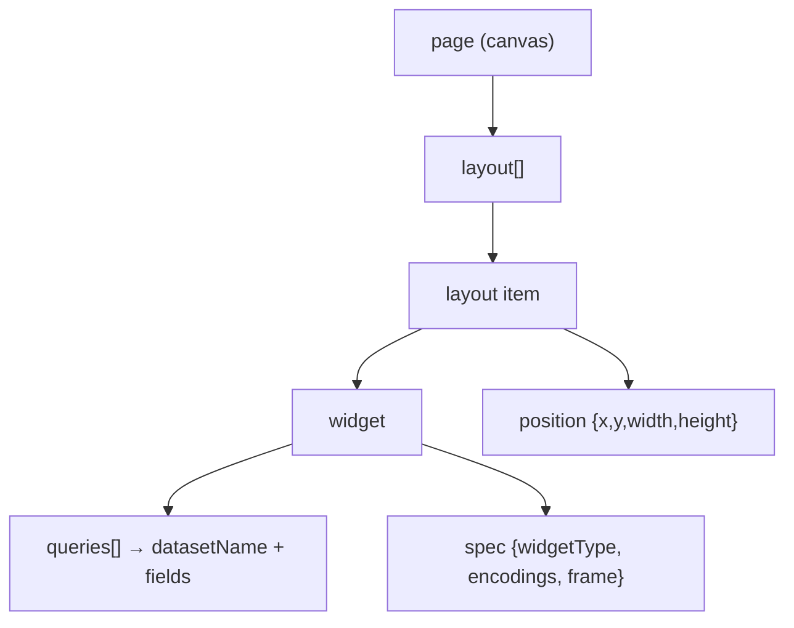
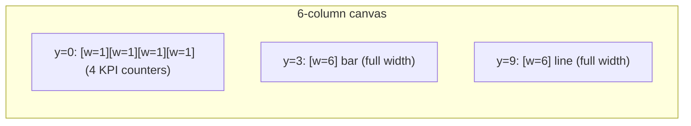

# Lakeview Dashboard JSON — Deep Dive (the `databricks_dashboard` structure)

> How a Databricks **Lakeview** dashboard is defined as JSON inside the
> `databricks_dashboard` Terraform resource, so you can author new observability
> dashboards (Phases 2, 4, 8, 9, 10) by copying the pattern. Grounded in this repo's
> existing `terraform/.../dashboards/dashboard-compute-cost.tf`.

**Contents**
1. Why dashboards are code here
2. The `databricks_dashboard` resource shell
3. The three top-level keys: `datasets`, `pages`, (`uiSettings`)
4. `datasets` — the queries
5. `pages` → `layout` → `widget` — the visuals
6. Widget types & encodings (counter, bar, line, table)
7. The grid positioning model
8. Permissions
9. A minimal end-to-end example
10. Authoring workflow & gotchas
11. Glossary

---

## 1. Why dashboards are code here

Instead of clicking dashboards together in the UI, this repo defines them as
**`databricks_dashboard`** Terraform resources with a **`serialized_dashboard`** JSON
body. Benefits: reviewable in PRs, promoted dev→uat→prod, reproducible across regions,
and diffable. Every observability dashboard follows the exact structure below.



---

## 2. The `databricks_dashboard` resource shell

From the real file (trimmed):

```hcl
resource "databricks_dashboard" "compute_cost" {
  display_name         = "[${upper(var.environment)}] Compute Cost & Usage"
  warehouse_id         = var.sql_warehouse_id       # runs the dataset queries
  parent_path          = "/Shared"                  # where it lives in the workspace
  serialized_dashboard = jsonencode({               # the whole dashboard, as JSON
    datasets = [ ... ]
    pages    = [ ... ]
  })
}
```

| Field | Meaning |
|-------|---------|
| `display_name` | title shown in the UI (env-prefixed here) |
| `warehouse_id` | the SQL warehouse that executes the dataset queries |
| `parent_path` | workspace folder (e.g. `/Shared`) |
| `serialized_dashboard` | **the dashboard definition** as a JSON string (`jsonencode` of an HCL object) |

`jsonencode({...})` lets you write the JSON as a native Terraform object (with `${}`
interpolation for env/catalog values) and have Terraform serialise it.

---

## 3. The three top-level keys

Inside `serialized_dashboard`:



- **`datasets`** — named queries. Each produces a result set.
- **`pages`** — one or more canvases; each has a `layout` of **widgets** that visualise
  datasets.
- Widgets reference datasets **by name**, which is the glue between the two.

---

## 4. `datasets` — the queries

Each dataset is a named SQL query. From the real file:

```hcl
datasets = [
  {
    name        = "ds_cost_by_product"
    displayName = "Cost by Product (Last 30 Days, USD)"
    queryLines  = [
      "WITH prices AS (\n",
      "  SELECT sku_name, pricing.effective_list.default AS price_per_dbu\n",
      "  FROM system_table_unitycatalog_prd.billing.list_prices\n",
      "  WHERE currency_code = 'USD' AND price_end_time IS NULL\n",
      ")\n",
      "SELECT u.billing_origin_product, ROUND(SUM(...),2) AS cost_usd\n",
      "FROM system_table_unitycatalog_prd.billing.usage u\n",
      "LEFT JOIN prices p ON u.sku_name = p.sku_name\n",
      "... GROUP BY u.billing_origin_product ORDER BY cost_usd DESC"
    ]
  }
]
```

| Key | Meaning |
|-----|---------|
| `name` | internal id widgets reference (e.g. `ds_cost_by_product`) |
| `displayName` | human label |
| `queryLines` | the SQL, as an **array of strings** concatenated (note the `\n`) |

**Why `queryLines` (an array)?** It keeps long SQL readable in HCL and lets you
interpolate `${var...}`/`${system_catalog}` per line. The array is just joined into one
query. This is where your Phase 2/4/8/9/10 SQL (from `implementations/`) goes.

---

## 5. `pages` → `layout` → `widget` — the visuals



A page:

```hcl
pages = [
  {
    name        = "compute_cost"
    displayName = "Compute Cost & Usage"
    pageType    = "PAGE_TYPE_CANVAS"
    layout = [
      {
        widget = {
          name    = "w_cost_by_product"
          queries = [{ name = "main_query", query = {
            datasetName   = "ds_cost_by_product"
            fields        = [
              { name = "billing_origin_product", expression = "`billing_origin_product`" },
              { name = "cost_usd",               expression = "`cost_usd`" }
            ]
            disaggregated = false
          }}]
          spec = { version = 3, widgetType = "bar",
            encodings = {
              x     = { fieldName = "billing_origin_product", scale = { type = "categorical" } }
              y     = { fieldName = "cost_usd",               scale = { type = "quantitative" } }
              color = { fieldName = "billing_origin_product" }
            }
            frame = { showTitle = true, title = "Cost by Product — Last 30 Days (USD)" }
          }
        }
        position = { x = 0, y = 3, width = 6, height = 6 }
      }
    ]
  }
]
```

Each `layout` item = one **widget** + its **position** on the grid.

---

## 6. Widget types & encodings

The `spec.widgetType` picks the visual; `encodings` map dataset fields to visual roles:

| `widgetType` | Use | Key encodings |
|--------------|-----|---------------|
| `counter` | a single KPI number | `value` |
| `bar` | categorical comparison | `x` (categorical), `y` (quantitative), `color` |
| `line` | trend over time | `x` (temporal), `y` (quantitative), `color` |
| `table` | detail rows | `columns` |
| `pie` / `area` | proportions / stacked trend | as above |

Real examples from the file:
- **Counter:** `spec = { version=2, widgetType="counter", encodings = { value = { fieldName="cost_this_month_usd" }}, frame={...} }`
- **Line:** `x = { fieldName="usage_date", scale={ type="temporal" }}`, `y = { ... quantitative }`, `color = { fieldName="billing_origin_product" }`.

**`fields` + `expression`:** each query block lists the fields it surfaces, with an
`expression` (usually the backticked column name). Encodings then reference those
`fieldName`s.

---

## 7. The grid positioning model

`position = { x, y, width, height }` places widgets on a grid:

- The canvas is **6 columns** wide (the compute-cost dashboard uses widths summing to 6
  per row).
- `x` = column start (0–5), `y` = row start, `width`/`height` in grid units.

```
Row 1 (y=0): four counters, each width=1, x=0..3, height=3
Row 2 (y=3): bar chart, x=0, width=6, height=6   (full width)
Row 3 (y=9): line chart, x=0, width=6, height=6
```



Plan your rows so widths add up to 6; increment `y` by the previous row's height.

---

## 8. Permissions

Each dashboard is paired with a `databricks_permissions` resource using the existing
AD-group model:

```hcl
resource "databricks_permissions" "compute_cost_dashboard" {
  dashboard_id = databricks_dashboard.compute_cost.id
  access_control {
    group_name       = var.admin_group
    permission_level = "CAN_MANAGE"
  }
  # + CAN_VIEW for owner/user groups in the other dashboards
}
```

For **Phase 8 (security/audit)**, restrict to the admin/security group only — do **not**
grant the general users group `CAN_VIEW` on audit data.

---

## 9. A minimal end-to-end example (new health KPI)

To add a "job success rate (7d)" counter for Phase 2:

```hcl
serialized_dashboard = jsonencode({
  datasets = [{
    name       = "ds_success_rate"
    queryLines = [
      "SELECT ROUND(100.0*SUM(CASE WHEN result_state='SUCCEEDED' THEN 1 ELSE 0 END)\n",
      "  /NULLIF(COUNT(*),0),1) AS success_rate_pct\n",
      "FROM ${system_catalog}.lakeflow.job_run_timeline\n",
      "WHERE period_start_time >= CURRENT_DATE - INTERVAL 7 DAYS AND result_state IS NOT NULL"
    ]
  }]
  pages = [{
    name = "health", displayName = "Pipeline Health", pageType = "PAGE_TYPE_CANVAS"
    layout = [{
      widget = {
        name    = "w_success_rate"
        queries = [{ name="main_query", query = {
          datasetName="ds_success_rate",
          fields=[{ name="success_rate_pct", expression="`success_rate_pct`" }],
          disaggregated=false }}]
        spec = { version=2, widgetType="counter",
          encodings={ value={ fieldName="success_rate_pct", displayName="Success %" }},
          frame={ showTitle=true, title="Job Success Rate (7d)" } }
      }
      position = { x=0, y=0, width=2, height=3 }
    }]
  }]
})
```

Swap `${system_catalog}` for `system_table_unitycatalog_prd` at deploy. This is the whole
recipe: **dataset (SQL) → widget (spec + encodings) → position.**

---

## 10. Authoring workflow & gotchas

**Workflow (recommended):**
1. Prototype the dashboard in the Lakeview **UI**, then **export** its JSON — gives you a
   correct `serialized_dashboard` to paste and parametrise. Faster than hand-writing.
2. Replace literal catalog names with `${system_catalog}` / `${var...}`.
3. Wrap in `databricks_dashboard` + `databricks_permissions`, add to the stack.
4. `terraform plan/apply`; verify in `/Shared`.

**Gotchas:**
- **`version` per widget** — counters use `version=2`, bar/line often `version=3`; copy
  from a known-good widget rather than guessing.
- **`fields` must match query output** — a widget encoding referencing a fieldName not in
  the dataset silently renders empty.
- **Grid widths** — if a row's widths exceed 6, layout wraps oddly.
- **`queryLines` newlines** — keep the `\n` at line ends or tokens run together.
- **Warehouse must be running / accessible** — an empty dashboard is often a warehouse or
  permission issue, not a query bug.
- **System-catalog alias** — same `${system_catalog}` rule as everywhere; the EU
  workspace may differ from us-east-1.
- **Big SQL** — for very long queries, the `queryLines` array stays readable; the
  existing compute-cost file is the reference for scale.

---

## 11. Glossary

| Term | Meaning |
|------|---------|
| **Lakeview** | Databricks' current dashboarding (replaces legacy SQL dashboards) |
| **`databricks_dashboard`** | Terraform resource wrapping a Lakeview dashboard |
| **`serialized_dashboard`** | the dashboard definition as a JSON string |
| **dataset** | a named query producing a result set |
| **`queryLines`** | the SQL as an array of strings (joined) |
| **page** | a canvas holding widgets |
| **widget** | one visual (counter/bar/line/table) |
| **encodings** | mapping of dataset fields to visual roles (x/y/value/color) |
| **spec.widgetType** | the kind of visual |
| **position** | `{x,y,width,height}` on the 6-column grid |
| **frame** | widget title/description chrome |
| **`databricks_permissions`** | who can view/manage the dashboard |

---

## 12. One-breath summary

> A Lakeview dashboard is a `databricks_dashboard` Terraform resource whose
> `serialized_dashboard = jsonencode({...})` holds two arrays: **`datasets`** (named SQL
> queries, written as `queryLines`) and **`pages`** (canvases of **widgets**, each a
> `spec` with a `widgetType` + `encodings` that map dataset `fields` to x/y/value/color,
> plus a `{x,y,width,height}` position on a 6-column grid). Widgets reference datasets by
> name. Pair each dashboard with `databricks_permissions` (restrict audit dashboards to
> admins), parametrise catalog names with `${system_catalog}`/`${var...}`, and the fastest
> way to author is to build in the UI, export the JSON, then parametrise it. The existing
> `dashboard-compute-cost.tf` is the canonical reference for every observability dashboard
> in Phases 2, 4, 8, 9, 10.
