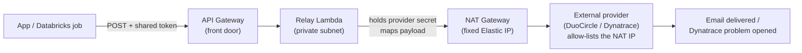
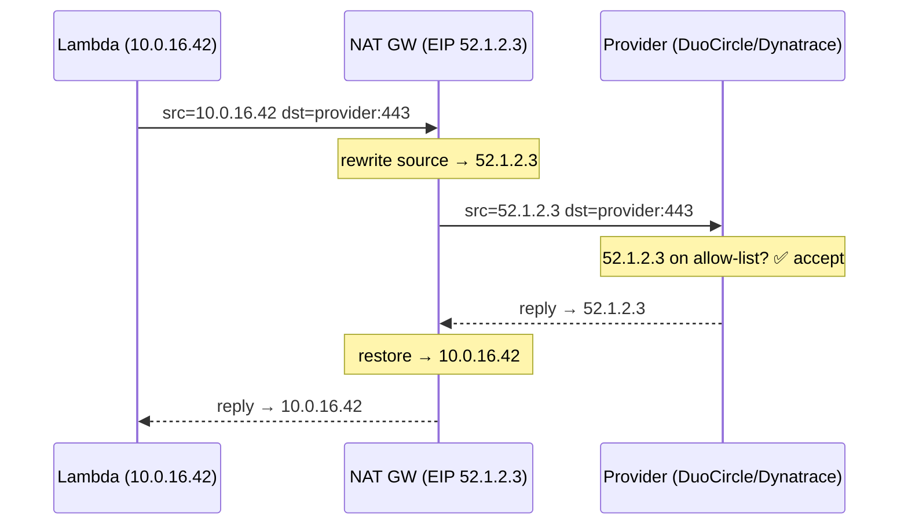

# Relay Pattern — Deep Dive (Complete Understanding)

> Companion to `relay-pattern-explained.md`. That doc teaches the *concept*; this one
> goes down to the **networking packets, protocols, AWS internals, real payloads,
> failure modes, and trade-offs** so you understand every layer. Read the intro first.
>
> **Related deep-dives:** `vpc-nat-networking-deep-dive.md` (the networking layer, tied
> to this repo's `vpc.tf`) and `databricks-webhook-payload-deep-dive.md` (the exact
> Databricks→Dynatrace payload mapping). See `README.md` in this folder for the map.

**Contents**
1. Networking foundations (VPC, subnets, route tables, IGW, NAT, Elastic IP)
2. Why outbound is hard #1 — port 25 and email deliverability (SPF/DKIM/DMARC)
3. Why outbound is hard #2 — IP allow-lists and reputation
4. SMTP protocol in practice
5. What a hosted relay service actually does
6. Lambda-in-a-VPC mechanics (ENIs, why VPC Lambda needs NAT)
7. API Gateway deep dive (HTTP vs REST, proxy integration, payload v2, auth)
8. The security layers, one by one
9. Full request lifecycle with REAL payloads (email + Dynatrace)
10. Failure modes, retries, idempotency
11. Observing the relay itself
12. Cost model
13. Testing & verification
14. Alternatives and when to pick them
15. End-to-end mental model

---

## 0. The whole picture in one diagram (Mermaid)



Everything below explains each box and arrow in this diagram.

---

## 1. Networking foundations

Everything about *why the relay is shaped the way it is* comes from AWS networking.
Build this mental model first.

### 1.1 VPC — your private network in the cloud

A **VPC (Virtual Private Cloud)** is an isolated network you own inside AWS, defined by
a **CIDR block** — a range of private IP addresses, e.g. `10.0.0.0/16` (65,536
addresses). Nothing in a VPC is reachable from the internet unless you explicitly wire
a path.

```
VPC  10.0.0.0/16
 ├── everything inside uses private IPs (10.0.x.x)
 └── private IPs are MEANINGLESS on the public internet
```

### 1.2 Subnets — slices of the VPC, one per Availability Zone

A **subnet** is a sub-range of the VPC CIDR, pinned to one **Availability Zone** (a
physical data-centre). Two kinds, and the difference is *entirely about their route
table*:

- **Public subnet** — its route table has a route to an **Internet Gateway**. Resources
  here *can* have public IPs and talk to the internet directly.
- **Private subnet** — **no** direct internet route. Resources here have only private
  IPs. To reach the internet they must go *through* something in a public subnet — a
  **NAT gateway**.

```
VPC 10.0.0.0/16
 ├── Public subnet  10.0.1.0/24   → route 0.0.0.0/0 via Internet Gateway
 │     └── NAT gateway lives here (needs internet-facing placement)
 └── Private subnet 10.0.16.0/20  → route 0.0.0.0/0 via NAT gateway
       └── the relay Lambda lives here
```

### 1.3 Route tables — the rules that make a subnet "public" or "private"

A **route table** is a list of "to reach destination X, send via next-hop Y" rules
attached to a subnet. The single line `0.0.0.0/0 → igw-...` (all other traffic to the
Internet Gateway) is what makes a subnet public. Swap that for `0.0.0.0/0 → nat-...`
and it's private.

### 1.4 Internet Gateway (IGW) vs NAT Gateway — the crucial distinction

| | Internet Gateway (IGW) | NAT Gateway |
|--|------------------------|-------------|
| Purpose | two-way internet for **public** subnets | **outbound-only** internet for **private** subnets |
| Who can start a connection | inbound *and* outbound | **outbound only** (replies come back, but nobody outside can initiate) |
| IP behaviour | resources use their own public IPs | **translates** many private IPs → **one shared public IP** |
| The relay uses | — | **this**, for its fixed egress IP |

**NAT = Network Address Translation.** When the private-subnet Lambda (10.0.16.42) sends
a packet to the internet, the NAT gateway rewrites the **source address** from
`10.0.16.42` to its own **Elastic IP** (say `52.1.2.3`), remembers the mapping, and
sends it on. The reply comes back to `52.1.2.3`, and the NAT rewrites it back to
`10.0.16.42`. To the outside world, *everything from the whole private subnet appears to
come from that one IP.*

### 1.5 Elastic IP — the "one fixed address" that makes allow-listing possible

An **Elastic IP (EIP)** is a static public IPv4 address you own in AWS. The NAT gateway
has one. Because it never changes, you can hand it to an external provider (DuoCircle,
or a partner API) and say *"only accept traffic from `52.1.2.3`."* That's the linchpin:
ephemeral compute + NAT + EIP = a **stable, allow-listable egress identity**.

### 1.6 Putting it together — the packet's journey out

```
Relay Lambda (private subnet, src=10.0.16.42)
   │  packet: src=10.0.16.42  dst=<DuoCircle IP>:443
   ▼
Route table: 0.0.0.0/0 → NAT gateway
   ▼
NAT gateway (in public subnet)  — rewrites source:
   │  packet: src=52.1.2.3 (Elastic IP)  dst=<DuoCircle IP>:443
   ▼
Internet Gateway → Internet → DuoCircle
   │  DuoCircle checks: "is 52.1.2.3 on my allow-list?"  ✅  → accepts
   ▼
reply retraces the path; NAT rewrites dst back to 10.0.16.42
```

This is the entire reason the relay is "a VPC Lambda in a **private** subnet" and not a
simpler internet-facing function. The placement *is* the design.

Same idea as a Mermaid sequence:



> For a full, standalone treatment of this networking (VPC, subnets, route tables, NAT,
> security groups, VPC endpoints) tied to this repo's `vpc.tf`, see
> `vpc-nat-networking-deep-dive.md`.

---

## 2. Why outbound is hard #1 — port 25 and email deliverability

### 2.1 Port 25 is blocked almost everywhere

SMTP's original port is **25**. Cloud providers (AWS included) **block outbound port 25
by default** on most compute because compromised machines historically used it to blast
spam. So even if you wanted to email the internet directly, the network usually won't
let you. Relay services accept mail on **other ports** (587 submission, 465 SMTPS, or an
HTTPS API on 443) precisely to sidestep this.

### 2.2 The deliverability trinity: SPF, DKIM, DMARC

Even if you *can* send, recipients decide whether to *trust* it. Three standards govern
this; a hosted relay handles them for you:

- **SPF (Sender Policy Framework)** — a DNS record on your domain listing *which IPs are
  allowed to send mail as `@yourcompany.com`*. The recipient checks: "did this mail come
  from an IP your SPF record authorises?" If you send from a random IP not in SPF → fail
  → spam/reject. (Note the symmetry with the NAT-fixed-IP idea: senders must come from
  *known* IPs.)
- **DKIM (DomainKeys Identified Mail)** — the sender **cryptographically signs** each
  message with a private key; the public key is in your DNS. The recipient verifies the
  signature → proves the mail wasn't forged or tampered with.
- **DMARC** — a DNS policy that says "if SPF **and/or** DKIM fail, do X (quarantine /
  reject)" and asks for reports. It ties SPF+DKIM to your visible `From:` domain.

### 2.3 IP reputation

Mail providers score sending IPs by history (spam complaints, bounce rates, volume
spikes). A brand-new or shared-bad IP lands in spam regardless of SPF/DKIM. Hosted
relays maintain **warmed, reputable IP pools** — a big part of what you pay them for.

**Takeaway:** "just send an email" actually means *navigate port blocking + SPF + DKIM +
DMARC + IP reputation + bounce handling + retries*. That's why DuoCircle-style services
exist, and why you route through one instead of rolling your own SMTP server.

---

## 3. Why outbound is hard #2 — IP allow-lists and reputation (the API case)

The same trust problem applies to **API** destinations, not just email:

- A provider may **allow-list source IPs** for defence in depth (even with a valid
  token, a call from an unexpected IP is refused). → needs the NAT fixed IP.
- A provider requires a **secret token** you must not scatter across every app. → the
  relay holds it once.
- Corporate egress may force all outbound through **specific NAT/proxy IPs** for audit.
  → the relay centralises that.

This is why the *email* relay pattern generalises cleanly to the *Dynatrace* relay — the
underlying "trusted, fixed, secret-holding egress point" need is identical.

---

## 4. SMTP protocol in practice (so "SMTP relay" isn't a black box)

SMTP is a simple line-based conversation. A (simplified) exchange to a relay on port 587:

```
C: (connect to relay:587)
S: 220 relay.duocircle.com ESMTP ready
C: EHLO myapp
S: 250-relay.duocircle.com / 250 STARTTLS / 250 AUTH LOGIN PLAIN
C: STARTTLS                         ← upgrade to encrypted
S: 220 ready to start TLS
   (TLS handshake — everything after is encrypted)
C: AUTH LOGIN                       ← authenticate with DC_USERNAME/DC_PASSWORD
S: 235 authentication succeeded
C: MAIL FROM:<alerts@yourcompany.com>
S: 250 OK
C: RCPT TO:<oncall@yourcompany.com>
S: 250 OK
C: DATA
S: 354 start mail input
C: Subject: Pipeline failed
C: (message body)
C: .                                ← lone dot ends the message
S: 250 queued as ABC123
C: QUIT
S: 221 bye
```

Key points:
- **Ports:** 25 (server-to-server, usually blocked outbound), **587** (client
  submission, STARTTLS), **465** (implicit TLS). Relays use 587/465 or an HTTPS API.
- **STARTTLS** upgrades the plaintext connection to encrypted before credentials/body.
- **AUTH** is where `DC_USERNAME`/`DC_PASSWORD` are used.
- Many modern relays wrap all this behind a **simple HTTPS REST API** (`DC_API_URL`) so
  your code POSTs JSON instead of speaking raw SMTP — which is what your Lambda does.

---

## 5. What a hosted relay service actually does for you

When you hand DuoCircle (or SES/SendGrid) a message, it:

1. **Accepts** it over an authenticated channel (SMTP-AUTH or API key).
2. **Signs** it with DKIM for your domain.
3. **Sends** from a **warmed, reputable IP pool** that passes SPF.
4. **Queues & retries** on temporary recipient failures (greylisting, 4xx).
5. **Handles bounces & complaints**, suppressing bad addresses.
6. **Reports** delivery/open/bounce metrics.

You could run your own SMTP server (Postfix) but you'd own all six — especially #3 and
#4, which are genuinely hard. That build-vs-buy is why the relay is a **third-party
service** with your Lambda just handing off to it.

---

## 6. Lambda-in-a-VPC mechanics (the part most people get wrong)

### 6.1 What a Lambda is

**AWS Lambda** runs your code on demand without you managing servers. You upload a
function; AWS executes it per request and bills per millisecond. By default a Lambda
runs in an AWS-managed network with its own internet access.

### 6.2 What changes when you put a Lambda "in a VPC"

To pin egress to your NAT's IP, the relay Lambda is **attached to your VPC's private
subnets**. When you do that:

- AWS gives the Lambda an **ENI (Elastic Network Interface)** — a virtual NIC with a
  **private IP** in your subnet. The function's traffic now originates from that private
  IP, subject to your route tables and security groups.
- **Consequence:** a VPC Lambda in a **private** subnet has **no internet access on its
  own** — it can only reach the internet if the subnet routes `0.0.0.0/0` to a **NAT
  gateway**. (A VPC Lambda in a *public* subnet still can't reach the internet directly,
  counter-intuitively — Lambda ENIs don't get auto-assigned public IPs. You *must* use
  NAT.) This is the #1 gotcha: "my VPC Lambda can't reach the internet" ≈ "no NAT route."

### 6.3 Why this is exactly what we want

That "no direct internet, only via NAT" behaviour is **the feature**, not a limitation:
it *forces* every outbound packet through the NAT's fixed Elastic IP — the allow-listed
identity. The VPC attachment is how you guarantee the egress IP.

### 6.4 Cold starts (a practical note)

VPC Lambdas attach an ENI; historically this made **cold starts** (first invocation
after idle) slower. AWS largely fixed this with shared ENIs, but a relay that fires
occasionally (on failures) may still see a ~sub-second cold start — irrelevant for a
notification relay, worth knowing.

---

## 7. API Gateway deep dive

### 7.1 Why it exists here

The Lambda needs a stable **URL** that apps (or Databricks) can POST to. **API Gateway**
provides that front door and routes matching requests to the Lambda.

### 7.2 HTTP API vs REST API

AWS has two flavours. Your repo uses **HTTP API** (the `apigateway-v2` module):

| | HTTP API (v2, used here) | REST API (v1) |
|--|--------------------------|----------------|
| Cost | cheaper | pricier |
| Latency | lower | higher |
| Features | core routing, JWT auth, proxy | more (API keys, usage plans, WAF, request validation) |
| Use when | simple webhook front-door | need the extra governance features |

For a relay, HTTP API is the right, lean choice.

### 7.3 Proxy integration & "payload format 2.0"

The route uses **Lambda proxy integration** with **payload format version 2.0**. That
means API Gateway passes the *entire* HTTP request to the Lambda as a JSON `event`
object, and expects a JSON response back. The v2.0 event shape (simplified):

```json
{
  "version": "2.0",
  "routeKey": "POST /ingest",
  "headers": { "x-relay-token": "abc", "content-type": "application/json" },
  "queryStringParameters": { "relay_token": "abc" },
  "body": "{\"job\":{\"name\":\"silver_wellbore\"}, ...}",   // the raw POST body as a string
  "isBase64Encoded": false,
  "requestContext": { "http": { "method": "POST", "path": "/ingest" } }
}
```

Your Lambda reads `event["body"]` (a **string** — you `json.loads` it), checks
`event["headers"]`/`queryStringParameters` for the shared token, and returns
`{ "statusCode": 200, "body": "..." }`.

### 7.4 Auth options (why we use a shared secret)

API Gateway HTTP APIs support: no-auth, IAM, JWT/OIDC, or Lambda authorizers. For a
webhook called by a third party (DuoCircle caller apps, or Databricks), a **simple
shared-secret header** checked inside the Lambda is the pragmatic choice — the caller
(Databricks notification destination) can attach a custom header, and IAM/JWT would be
awkward for it. That's the `RELAY_TOKEN` / `dynatrace_relay_token`.

### 7.5 `aws_lambda_permission` — the plumbing

API Gateway can't invoke your Lambda unless you grant it permission. The
`aws_lambda_permission "...apigw"` resource says *"allow this API Gateway to invoke this
function"*. Without it you get 500s. It's boilerplate but required.

---

## 8. The security layers, one by one

Defence in depth — each layer does one job:

1. **Egress-only Security Group (443)** — a stateful firewall on the Lambda's ENI that
   permits **only outbound HTTPS**. No inbound from the internet; can't be repurposed to
   reach anything but HTTPS destinations.
2. **Private subnet placement** — no route from the internet *to* the Lambda; the only
   way in is through API Gateway.
3. **Shared secret (`RELAY_TOKEN`)** — authenticates the *caller*. Someone who finds the
   API URL still can't use it without the token → can't send mail/events as you.
4. **Held-back provider secret (`DC_PASSWORD` / `dynatrace_api_token`)** — lives only in
   the Lambda's environment (ideally sourced from Secrets Manager), never in the callers,
   never in git.
5. **NAT fixed egress IP** — the destination provider additionally allow-lists the IP, so
   even a stolen provider secret used from elsewhere is refused.
6. **CloudWatch logs (120-day retention)** — an audit trail of every relayed message.

An attacker would need the API URL **and** the shared token **and** to be calling from
inside your network path **and** (to abuse the provider directly) the provider secret
**and** to originate from the allow-listed IP. That's the point of layering.

> **Secrets best practice:** the repo passes secrets as sensitive Terraform variables
> into Lambda env vars. A hardening step is to fetch them from **AWS Secrets Manager** at
> runtime instead, so they're not visible in the Lambda config — noted as an improvement,
> not a blocker.

---

## 9. Full request lifecycle with REAL payloads

### 9.1 Email path (DuoCircle)

```
1. App wants to notify:
   POST https://<api>/send
   Header: X-Relay-Token: <RELAY_TOKEN>
   Body:  { "to": "oncall@company.com", "subject": "Pipeline failed",
            "text": "silver_wellbore failed at 02:14 UTC" }

2. API Gateway → Lambda event (payload v2, body as string).

3. Lambda:
   - verifies X-Relay-Token == RELAY_TOKEN        (else 401)
   - builds the email, authenticates to DuoCircle (DC_USERNAME/DC_PASSWORD)
   - sends from DC_FROM via DuoCircle API (DC_API_URL)

4. Egress: Lambda(10.0.16.42) → NAT(52.1.2.3) → DuoCircle → recipient inbox.

5. Lambda returns { "statusCode": 200 }.
```

### 9.2 Event path (Dynatrace) — the Pattern 4 relay

```
1. Databricks job FAILS → webhook_notifications.on_failure fires:
   POST https://<api>/ingest
   Body (Databricks-defined):
   { "job": { "name": "silver_wellbore" },
     "run": { "run_id": 12345, "state": { "result_state": "FAILED" } },
     "workspace_id": "prj5642893-...-eu-west-1-prd" }

2. API Gateway → relay Lambda.

3. Lambda:
   - verifies relay token
   - MAPS Databricks body → Dynatrace event schema:
     { "eventType": "ERROR_EVENT",
       "title": "Databricks job failed: silver_wellbore",
       "entitySelector": "type(CUSTOM_DEVICE),entityName(databricks-jobs)",
       "properties": { "job.name": "silver_wellbore", "run.id": "12345",
                       "result_state": "FAILED", ... } }
   - POSTs to https://<tenant>/api/v2/events/ingest
     Header: Authorization: Api-Token <dynatrace_api_token>

4. Egress via NAT → Dynatrace → problem opens → alerting profile → on-call.

5. Lambda returns 200 (so Databricks doesn't retry-storm).
```

The **only** substantive difference between the two relays is step 3's mapping + the
destination. Same networking, same front door, same security layers.

---

## 10. Failure modes, retries, idempotency

A relay must be robust because it runs exactly when things are already going wrong
(failures are when you send alerts). Design rules the code follows:

- **Always return 200 to the caller** (even on internal hiccups), so Databricks/apps
  don't **retry-storm** the relay. Log the error for investigation instead.
- **Idempotency awareness** — a job that retries can fire multiple failure webhooks;
  configure the destination alerting profile to **de-duplicate** so one incident isn't
  100 problems. Prefer firing on *fatal* (no-retries-left) failures where possible.
- **Timeouts** — the Lambda has a 30s timeout; the outbound POST should have its own
  shorter timeout so a hung provider doesn't wedge the function.
- **Graceful degradation** — if the provider is down, log and drop rather than crash;
  an external watchdog (Dynatrace synthetic / the canary) catches systemic outages that
  a push relay can't report on itself.
- **Partial-parse tolerance** — webhook bodies vary; parse defensively and still emit a
  best-effort event rather than 500-ing.

---

## 11. Observing the relay itself (who watches the watcher)

The relay is infrastructure, so monitor it:

- **CloudWatch Logs** — every invocation logs the outcome (sent / rejected / provider
  error). Retention 120 days for audit.
- **CloudWatch Metrics** — Lambda `Errors`, `Throttles`, `Duration`; API Gateway `5xx`,
  `Latency`, `Count`. Alarm on error rate so a broken relay is itself detected.
- **The blind spot** — a push relay can't report its *own* total outage. That's why the
  overall design pairs it with an **external, pull-based watchdog** (Dynatrace Pattern 2
  synthetic monitor / the Phase 6 canary) that checks health from the outside.

---

## 12. Cost model (so there are no surprises)

Roughly, per relay:

- **Lambda** — per-request + per-ms; a failure-triggered relay fires rarely → effectively
  pennies/month.
- **API Gateway HTTP API** — per-million requests; negligible at notification volumes.
- **NAT gateway** — **the real cost**: an hourly charge **plus per-GB data processing**,
  ~24/7. NAT is usually already present for the VPC (shared), so the relay adds little;
  but be aware NAT is the line item people forget. (This is also why the VPC design uses
  a **single** NAT gateway where HA isn't required — cost vs. resilience trade-off you'll
  see in `vpc.tf`.)
- **CloudWatch Logs** — per-GB ingested + stored; trivial at these volumes.

---

## 13. Testing & verification

1. **Unit-test the Lambda mapping** — feed a sample Databricks/app body, assert the
   produced provider payload + that a missing token yields 401.
2. **Curl the deployed endpoint** with the shared token and a sample body → confirm the
   email arrives / the Dynatrace event appears.
3. **End-to-end** — force a dev job failure → watch the problem open in Dynatrace within
   seconds; confirm a *successful* run produces **no** event.
4. **Negative test** — call without the token → expect 401; call with a malformed body →
   expect a best-effort 200 + a logged warning, not a 500.
5. **Egress IP check** — from the Lambda, hit an "what's my IP" endpoint once and confirm
   it's the NAT Elastic IP you registered with the provider.

---

## 14. Alternatives and when to pick them

| Approach | Good when | Why you might NOT use it here |
|----------|-----------|-------------------------------|
| **This relay (Lambda+APIGW+NAT)** | need fixed IP, payload map, held-back secret | (this is the fit) |
| **Direct call from the app** | destination accepts any IP + app can hold the token safely | Databricks webhooks can't add auth headers / reshape body; providers allow-list IPs |
| **Amazon SES** (for email) | you want AWS-native email | DuoCircle already chosen/allow-listed; SES needs its own domain/IP warmup |
| **Amazon EventBridge** | routing AWS-native events between AWS services | Dynatrace/DuoCircle are external SaaS, not native EventBridge targets without extra glue |
| **Self-hosted SMTP (Postfix)** | full control | you'd own deliverability, reputation, retries — high effort |
| **Third-party iPaaS (Zapier/webhook proxy)** | quick, no infra | data leaves your controlled network; less auditable; recurring SaaS cost |

The relay wins precisely when you need **your own controlled, auditable, fixed-IP,
secret-holding choke point** — which is the situation here.

---

## 15. End-to-end mental model (say it back in one breath)

> Ephemeral compute can't be trusted by external providers because it has no fixed IP and
> shouldn't hold shared secrets. So you build a **relay**: a **Lambda** (the worker)
> behind an **API Gateway** (the front door), placed in a **private subnet** so all its
> outbound traffic is forced through a **NAT gateway** with a single **Elastic IP** that
> the provider **allow-lists**. The Lambda holds the provider **secret**, is itself
> protected by a **shared token**, **converts** the incoming payload into the provider's
> format, and **forwards** it. Email (DuoCircle) and failure-events (Dynatrace) are the
> **same machine** with a different destination and mapping. Robustness rules — always
> 200 to the caller, de-dup, timeouts, log everything — keep it reliable exactly when
> you need it (during incidents), and an external watchdog covers the one thing a push
> relay can't: reporting its own outage.

Once this paragraph feels obvious, you understand the pattern completely.
