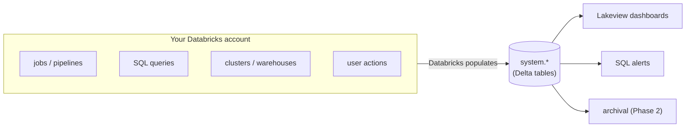
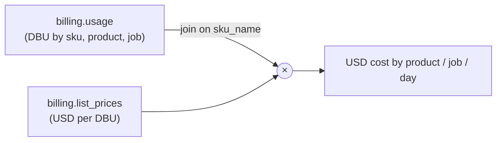
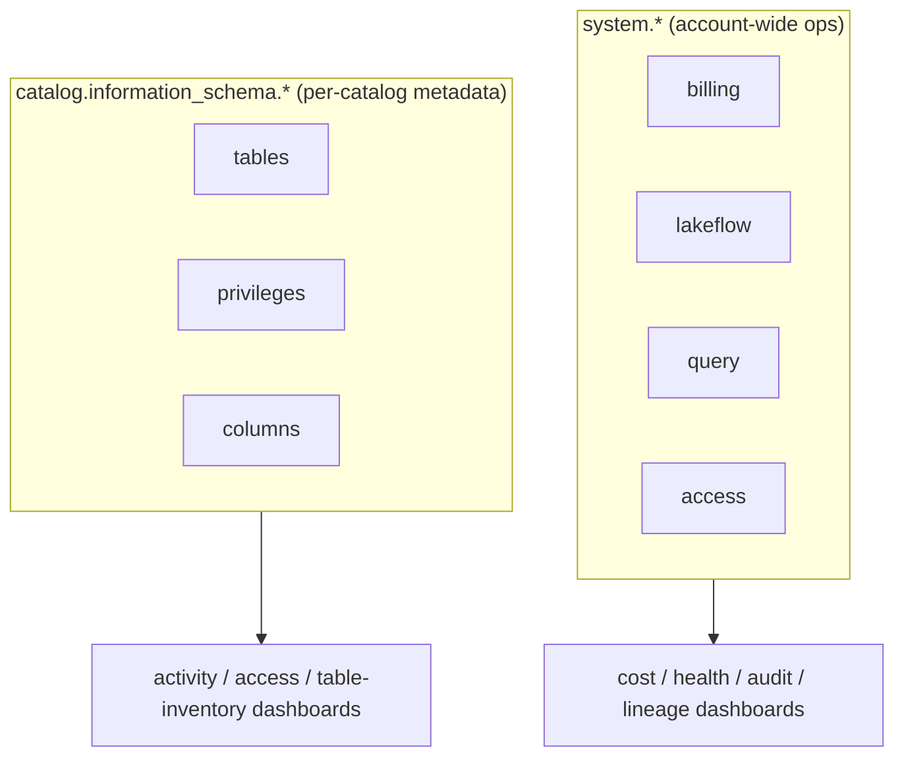

# Unity Catalog System Tables — Deep Dive (the telemetry all dashboards read)

> The `system.*` schemas are the single source of truth for cost, job health, query
> performance, audit, and lineage. Every non-OTel observability phase queries them.
> Grounded in this estate, where the system catalog is surfaced as
> **`system_table_unitycatalog_prd`** (not vanilla `system`).

**Contents**
1. What system tables are
2. The critical naming detail in this estate
3. The schemas that matter (and which phase uses each)
4. `billing` — cost (Phases 0, 5)
5. `lakeflow` — jobs & pipelines (Phase 2)
6. `query` — SQL performance (Phase 4)
7. `compute` — clusters & warehouses (Phases 0, 4)
8. `access` — audit & lineage (Phases 8, 9)
9. `information_schema` vs `system` (Phases 9, 10)
10. Enablement, latency & retention
11. Permissions
12. Gotchas & glossary

---

## 1. What system tables are

Databricks **system tables** are Databricks-managed, read-only Delta tables that expose
**operational telemetry about your own account** — billing, job runs, query history,
audit logs, lineage, compute inventory — as plain SQL you can query, dashboard, and
alert on. No agent, no export: Databricks populates them for you.

They are the reason **Phases 0, 2, 4, 5, 8, 9, 10 need no external tooling** — the data
is already there.

---

## 2. The critical naming detail in this estate

Vanilla Databricks exposes these under the catalog **`system`** (e.g.
`system.billing.usage`). **In this estate they are surfaced as
`system_table_unitycatalog_prd`** (a Shell-internal catalog). You can see this in the
existing `dashboard-compute-cost.tf`, which queries
`system_table_unitycatalog_prd.billing.usage`, `.compute.clusters`, etc.

> **Every SQL file in `implementations/` uses a `${system_catalog}` placeholder** for
> exactly this reason — substitute `system_table_unitycatalog_prd` (or the correct alias
> for the target workspace) at deploy. Always confirm the alias per workspace; the EU
> workspace may differ.

---

## 3. The schemas that matter

| Schema | Contains | Phase(s) |
|--------|----------|----------|
| `billing` | DBU usage + list prices → USD cost | 0, 5 |
| `lakeflow` | job runs, task runs, pipelines | 2 |
| `query` | SQL statement history | 4 |
| `compute` | clusters, warehouses, warehouse events, node types | 0, 4 |
| `access` | audit log, table/column lineage | 8, 9 |
| `storage` (where available) | storage inventory | 10 (supplementary) |
| `information_schema` (per-catalog) | table/column metadata, privileges | 9, 10, (existing user-usage dashboards) |

---

## 4. `billing` — cost (Phases 0, 5)

The cost story is a **join** between usage (in DBU) and prices (USD per DBU):

| Table | Key columns |
|-------|-------------|
| `billing.usage` | `usage_date`, `usage_quantity`, `usage_unit` (`DBU`), `sku_name`, `billing_origin_product` (`ALL_PURPOSE`/`JOBS`/`SQL`/`DLT`…), `usage_metadata.job_id`, `workspace_name`, `record_id` |
| `billing.list_prices` | `sku_name`, `pricing.effective_list.default` (price/DBU), `currency_code`, `price_end_time` |

Cost = `SUM(usage.usage_quantity * list_prices.price_per_dbu)`. The existing
compute-cost dashboard does exactly this. `billing_origin_product = 'ALL_PURPOSE'` +
`usage_metadata.job_id IS NOT NULL` is the **compute-policy-compliance** signal (Phase 0:
jobs on interactive clusters).

---

## 5. `lakeflow` — jobs & pipelines (Phase 2)

| Table | Gives |
|-------|-------|
| `lakeflow.jobs` | job_id → name, current definition |
| `lakeflow.job_run_timeline` | per-run status, `result_state`, start/end, trigger |
| `lakeflow.job_task_run_timeline` | per-task status & duration |
| `lakeflow.pipelines` (where present) | pipeline inventory/state |

This is the backbone of the Phase 2 health dashboard (success rate, duration trends, top
failing tasks) and the Phase 5 failure-rate/SLO alerts. Note: **DLT per-flow / expectation
detail is NOT here** — that's in the pipeline **event_log** (see
`dlt-event-log-deep-dive.md`). `lakeflow` = orchestration-level; `event_log` =
inside-the-pipeline.

---

## 6. `query` — SQL performance (Phase 4)

`query.history` — one row per SQL statement: `total_duration_ms`,
`waiting_for_compute_duration_ms` (queue time), `spilled_local_bytes`, `read_rows`,
`read_bytes`, `executed_by`, `compute.warehouse_id`, `execution_status`,
`statement_text`. This powers the Phase 4 slowest-queries, queue-time, and spill panels.
Queue time is the leading indicator that a warehouse is under-provisioned.

---

## 7. `compute` — clusters & warehouses (Phases 0, 4)

| Table | Gives |
|-------|-------|
| `compute.clusters` | classic cluster inventory + lifecycle (change_time, delete_time) |
| `compute.warehouses` | SQL warehouse inventory |
| `compute.warehouse_events` | scale-up/down, STARTING/RUNNING/STOPPED (Phase 4 utilisation) |
| `compute.node_types` | instance-type reference |

The existing dashboard uses a `ROW_NUMBER() … WHERE rn=1 AND delete_time IS NULL`
pattern over `compute.clusters`/`warehouses` to count *currently active* compute — a
useful idiom because these tables are **change-logs**, not current-state snapshots.

---

## 8. `access` — audit & lineage (Phases 8, 9)

| Table | Gives | Phase |
|-------|-------|-------|
| `access.audit` | every action (login, grant, query, token op) with actor, IP, timestamp | 8 (security) |
| `access.table_lineage` | table read/write edges (upstream/downstream) | 9 (lineage) |
| `access.column_lineage` | column-level provenance | 9 |

`access.audit` is the SOC2/forensics backbone (Phase 8 failed-logins, grant changes,
token creation). `table_lineage`/`column_lineage` power Phase 9 impact analysis across
the medallion's silver→gold chains — populated automatically by UC, no instrumentation.

---

## 9. `information_schema` vs `system`

Two related but different things:

- **`system.*`** — account-wide operational telemetry (cost, runs, audit, lineage).
- **`<catalog>.information_schema.*`** — ANSI-standard **metadata about one catalog's
  objects**: `tables` (with `created_by`, `last_altered_by`, timestamps),
  `table_privileges`, `schema_privileges`, `columns`. Your existing **User Usage /
  Active Users** dashboards run on `information_schema` (activity/access), and Phase 10
  uses `information_schema.tables` as the inventory to drive `DESCRIBE DETAIL` per table.

---

## 10. Enablement, latency & retention

- **Enablement:** some system schemas must be **enabled** per metastore (an admin action
  via the account API). `access`, `billing`, `lakeflow`, `query` may need turning on
  before rows appear. If a table is empty, check enablement first.
- **Latency:** system tables are **near-real-time, not instant** — expect minutes of lag
  (audit/query can be ~15 min; billing updates through the day). Don't build
  second-level alerting on them; that's what Pattern 4 webhooks are for.
- **Retention:** bounded (commonly ~365 days, varies by table). This is exactly why
  **Phase 2 archival** snapshots billing/audit/lineage into owned Delta tables for
  long-term trend and compliance.

---

## 11. Permissions

Querying system tables requires grants on the system schemas (or the
`system_table_unitycatalog_prd` catalog here). Dashboards run under a **SQL warehouse**
and the **dashboard owner/viewer** permission model already used in the `dashboards`
stack (admin/owner/user AD groups). Security-sensitive dashboards (Phase 8 audit)
should be restricted to the admin/security group only — don't expose audit data to the
general users group.

---

## 12. Gotchas & glossary

**Gotchas**
- **Wrong catalog name** — `system` vs `system_table_unitycatalog_prd`; always use the
  `${system_catalog}` placeholder and confirm per workspace.
- **Change-log vs snapshot** — `compute.clusters` etc. are histories; use
  `ROW_NUMBER()` to get current state.
- **Column drift** — exact column names vary slightly by Databricks release; confirm
  against the workspace (every `implementations/*.sql` notes this).
- **Empty table** — usually means the schema isn't enabled yet, not that nothing
  happened.
- **Latency** — minutes of lag; not for real-time paging.
- **Cost = usage × price** — never read "cost" directly; always join `usage` to
  `list_prices` filtered to `currency_code='USD'` and `price_end_time IS NULL`.

**Glossary**

| Term | Meaning |
|------|---------|
| **System table** | Databricks-managed read-only telemetry table |
| **DBU** | Databricks Unit — the usage/billing unit (× price = USD) |
| **sku_name** | the billed product/SKU (joins usage to price) |
| **billing_origin_product** | ALL_PURPOSE / JOBS / SQL / DLT etc. |
| **list_prices** | USD-per-DBU reference |
| **lakeflow** | the jobs/pipelines schema |
| **job_run_timeline** | per-run status table |
| **query.history** | per-statement SQL history |
| **access.audit** | the audit log table |
| **table_lineage / column_lineage** | UC-populated lineage edges |
| **information_schema** | per-catalog ANSI metadata |
| **system_table_unitycatalog_prd** | this estate's alias for the `system` catalog |

---

## 13. One-breath summary

> Databricks **system tables** are managed, read-only Delta tables exposing your own
> account's telemetry as SQL — **`billing`** (DBU × `list_prices` = USD; the
> interactive-job signal for Phase 0), **`lakeflow`** (job/task run timelines for Phase
> 2), **`query.history`** (SQL performance for Phase 4), **`compute`** (cluster/warehouse
> inventory + events, as change-logs needing `ROW_NUMBER()`), and **`access`** (audit for
> Phase 8, lineage for Phase 9). Per-catalog **`information_schema`** adds object/privilege
> metadata (Phase 10 inventory, existing user dashboards). In **this estate** they live
> under **`system_table_unitycatalog_prd`**, so all SQL uses a `${system_catalog}`
> placeholder. They're near-real-time (minutes of lag), retention-bounded (hence Phase 2
> archival), may need enabling per metastore, and require the right grants — restrict the
> audit dashboard to security/admins.
