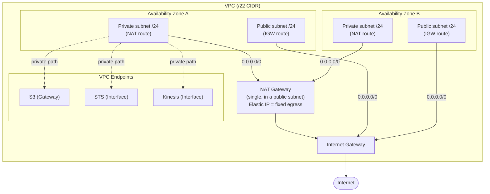
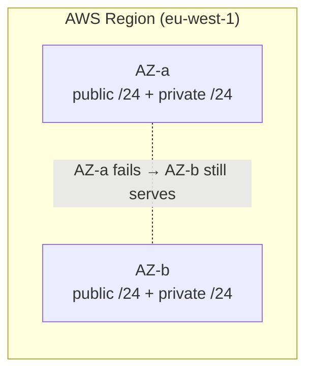
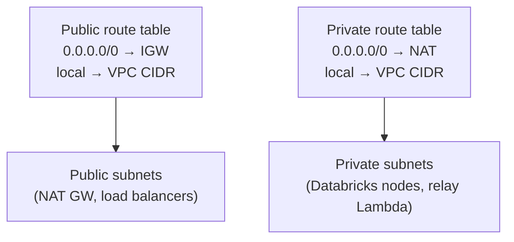
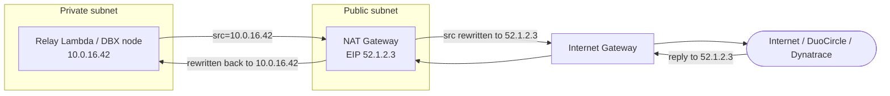
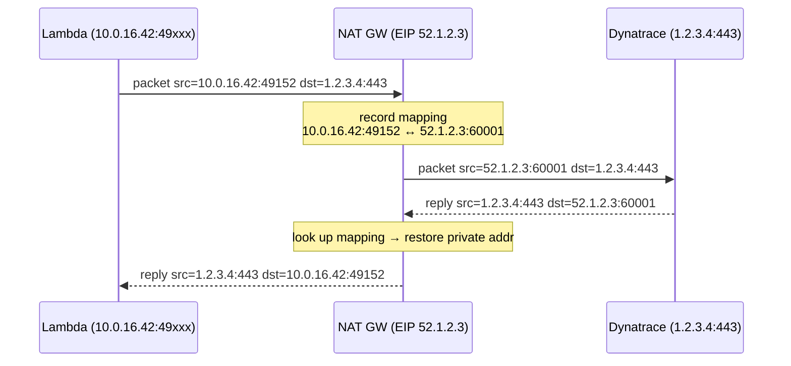
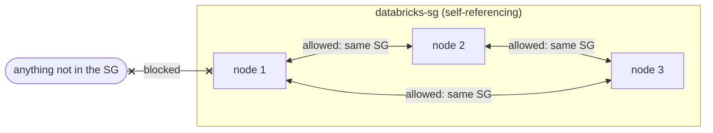
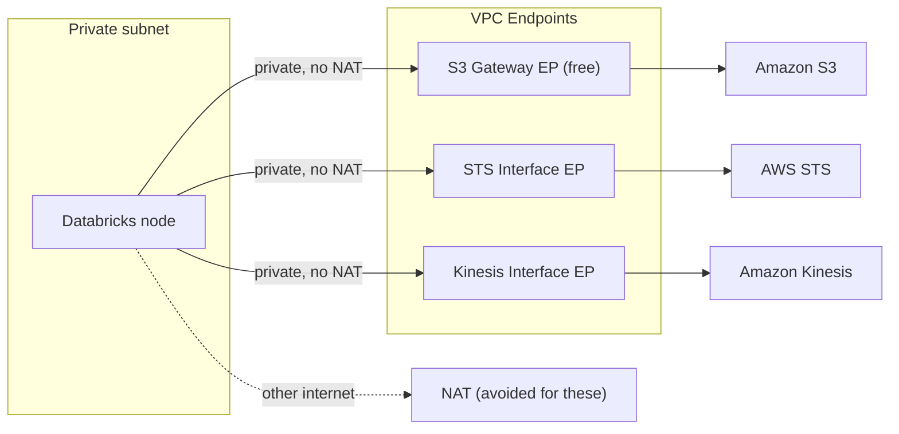
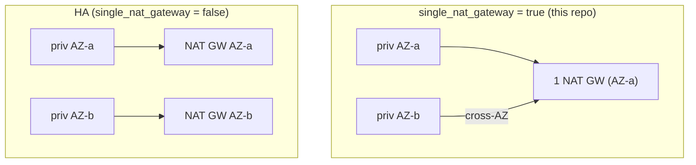

# AWS VPC & NAT Networking — Deep Dive (grounded in this repo's `vpc.tf`)

> A standalone, complete explanation of the networking that makes the relay pattern
> (and Databricks connectivity) work. Every concept is tied back to the actual
> `terraform/.../scops-core/vpc.tf` in this repo. Read `relay-pattern-deep-dive.md`
> first if you haven't — this zooms into just the networking layer.

**Contents**
1. The repo's actual VPC at a glance
2. VPC & CIDR — the address space
3. Availability Zones — why everything is duplicated
4. Subnets — public vs private (it's all about the route table)
5. Route tables — the rules that decide "public" or "private"
6. Internet Gateway vs NAT Gateway
7. NAT translation — a packet-level walkthrough
8. Elastic IP — the fixed, allow-listable identity
9. Security Groups vs NACLs — the two firewalls
10. VPC Endpoints — private paths to AWS services (S3/STS/Kinesis)
11. Single vs HA NAT — the cost/resilience trade-off in this repo
12. How Databricks uses all of this
13. Common failure modes & how to diagnose
14. Glossary

---

## 1. The repo's actual VPC at a glance

From `vpc.tf` (the EU Databricks VPC), the real topology is:

- **2 Availability Zones**
- **2 private + 2 public** `/24` subnets (251 usable IPs each)
- **VPC CIDR `/22`** for headroom
- **IGW** on the public subnets, **single NAT gateway** for private egress
- A self-referencing **"databricks-sg"** security group
- **VPC endpoints:** S3 (Gateway), STS + Kinesis (Interface)



Keep this picture in mind; the rest of the doc explains each part.

---

## 2. VPC & CIDR — the address space

A **VPC** is your private network in AWS, defined by a **CIDR block**. This repo uses a
**`/22`** — that's `2^(32-22) = 1024` addresses. Why `/22` and not the more common
`/24`? The comment says *"VPC CIDR /22 for headroom"* — room to add more subnets later
without renumbering.

```
/22 = 1024 addresses  → carved into four /24 subnets (256 each) with room to spare
```

**CIDR refresher:** the number after `/` is how many bits are *fixed* (network part).
Fewer bits fixed = bigger range:

| CIDR | Addresses | Usable* | Typical use |
|------|-----------|---------|-------------|
| /16 | 65,536 | 65,531 | large VPC |
| /22 | 1,024 | 1,019 | **this VPC** |
| /24 | 256 | 251 | **each subnet here** |
| /28 | 16 | 11 | tiny subnet |

\* AWS reserves 5 IPs per subnet (network, router, DNS, future, broadcast), so a `/24`
gives **251** usable — exactly what the repo comment states.

---

## 3. Availability Zones — why everything is duplicated

An **Availability Zone (AZ)** is a physically separate data-centre within a region. The
repo uses **2 AZs**, and you'll notice subnets come in pairs (one per AZ). The reason is
**resilience**: if one AZ fails, resources in the other keep running. This is why there
are 2 public and 2 private subnets — one of each per AZ.



---

## 4. Subnets — public vs private (it's all about the route table)

A **subnet** is a slice of the VPC CIDR, pinned to one AZ. The *only* thing that makes a
subnet "public" or "private" is **what its route table says about `0.0.0.0/0`** (the
"everything else / the internet" route):

- **Public subnet** → `0.0.0.0/0` points at the **Internet Gateway**. Two-way internet.
- **Private subnet** → `0.0.0.0/0` points at the **NAT Gateway**. Outbound-only internet.

Same size, same VPC — different route table. That's the whole distinction.



In this repo the **NAT gateway lives in a public subnet** (it needs internet-facing
placement), and the **workloads live in private subnets** (so their egress is forced
through NAT).

---

## 5. Route tables — the rules engine

A **route table** is an ordered list of `destination → next-hop` rules. Every subnet has
exactly one. A minimal private-subnet route table:

| Destination | Target | Meaning |
|-------------|--------|---------|
| `10.0.0.0/22` (VPC CIDR) | `local` | talk within the VPC directly |
| `0.0.0.0/0` | `nat-…` | everything else → NAT gateway |

The `local` route is automatic and can't be removed — it's what lets subnets in the same
VPC talk to each other. The `0.0.0.0/0` line is the one you control, and it's the
public/private switch.

---

## 6. Internet Gateway vs NAT Gateway (the heart of it)



| | Internet Gateway | NAT Gateway |
|--|------------------|-------------|
| Direction | inbound **and** outbound | **outbound only** |
| Who can initiate | anyone (if SG/NACL allow) | only the private resource |
| IP handling | resource uses its own public IP | **translates** private → one shared EIP |
| Lives in | attached to the VPC | **in a public subnet** |
| The relay/DBX uses | — (private resources have no public IP) | **this** |

**Key insight:** private resources have *no public IP at all*. They can only reach the
internet because the NAT gateway lends them its **one** public IP for the round trip.

---

## 7. NAT translation — packet-level walkthrough

"NAT" = **Network Address Translation**. Here's what the NAT gateway literally does,
step by step, when the relay Lambda calls Dynatrace:



To Dynatrace, the request *came from* `52.1.2.3` — the only IP it needs to allow-list.
The Lambda's real `10.0.16.42` is never seen outside the VPC. This is exactly why the
"fixed egress IP" works for allow-listing.

---

## 8. Elastic IP — the fixed identity

The NAT gateway holds an **Elastic IP (EIP)** — a static public IPv4 that doesn't change
even if the NAT is recreated (you re-associate the same EIP). Because it's stable, you
can register it on an external provider's allow-list once and forget it. Without an EIP,
egress IPs would rotate and allow-listing would be impossible.

In `vpc.tf` you'll see the NAT and its EIP tagged (`nat_eip_tags`) so Databricks/ops
scripts can find them by Name — a small but telling detail that this IP is treated as a
first-class, referenced asset.

---

## 9. Security Groups vs NACLs — the two firewalls

Two independent firewall layers; know the difference:

| | Security Group (SG) | Network ACL (NACL) |
|--|---------------------|---------------------|
| Attaches to | an **ENI / instance** (e.g. the Lambda) | a **subnet** |
| Stateful? | **Yes** — return traffic auto-allowed | **No** — must allow both directions |
| Rules | **allow only** | allow **and** deny |
| Default | deny all inbound, allow all outbound | allow all (default NACL) |

The relay's **egress-only SG** (allow outbound 443, no inbound) is a *security group*.
Because SGs are **stateful**, the HTTPS *reply* from DuoCircle/Dynatrace is automatically
permitted even though there's no explicit inbound rule — you only had to allow the
outbound request.

The repo's **"databricks-sg"** is a **self-referencing** SG: it allows all traffic
*from members of the same SG*. That's how Databricks cluster nodes talk to each other
freely while staying closed to everything else — a standard Databricks requirement.



---

## 10. VPC Endpoints — private paths to AWS services

By default, reaching an AWS service (S3, STS, Kinesis) from a private subnet goes out via
NAT → internet → back to AWS. That works but (a) costs NAT data-processing charges and
(b) sends the traffic over the public internet path. **VPC Endpoints** give a **private**
route straight to the AWS service, staying on the AWS network.

This repo's `vpc.tf` defines three, for good reasons:

| Endpoint | Type | Why |
|----------|------|-----|
| **S3** | **Gateway** (free) | avoids NAT $ for S3 data traffic (Databricks reads/writes a lot of S3) |
| **STS** | **Interface** | Databricks control-plane IAM role assumption from private subnets |
| **Kinesis** | **Interface** | Databricks cluster log/event streaming |



**Gateway vs Interface endpoints:**
- **Gateway** (S3, DynamoDB only) — a route-table entry; **free**; no ENI.
- **Interface** (most services) — an **ENI** with a private IP in your subnet + private
  DNS; billed per-hour + per-GB, but keeps traffic private and off NAT.

---

## 11. Single vs HA NAT — the trade-off this repo made

`vpc.tf` sets `single_nat_gateway = true` with the comment *"matches US (single NAT); set
to false for HA."* This is a deliberate **cost vs resilience** decision:

- **Single NAT** — one NAT gateway for all AZs. Cheaper (one hourly charge + one EIP).
  **Risk:** if that NAT's AZ fails, private-subnet egress in *all* AZs is down.
- **HA NAT** — one NAT **per AZ**. Survives an AZ failure. Costs N× the hourly + N EIPs +
  a little cross-AZ data.

For a Databricks data platform where a brief egress interruption during a rare AZ outage
is tolerable, single NAT is a reasonable cost saving. For latency-critical or
strict-uptime workloads you'd flip to HA.



---

## 12. How Databricks uses all of this

- **Cluster nodes** run in the **private subnets** (no public IP — a security
  requirement). They reach the Databricks control plane + AWS services via **NAT** and the
  **VPC endpoints**.
- The **databricks-sg** self-referencing SG lets nodes in a cluster talk to each other.
- **S3 gateway endpoint** keeps the heavy data-plane S3 traffic off NAT (cost).
- **STS/Kinesis interface endpoints** keep control-plane IAM + log streaming private.
- The **NAT's fixed EIP** is the egress identity — the same mechanism the relay reuses
  for allow-listing at DuoCircle/Dynatrace.

So the networking you learned for the relay **is** the networking Databricks itself
depends on — one model, reused.

---

## 13. Common failure modes & how to diagnose

| Symptom | Likely cause | Check |
|---------|--------------|-------|
| VPC Lambda / node can't reach internet | private subnet has **no NAT route** (or NAT down) | route table `0.0.0.0/0` target; NAT health |
| Can reach internet but provider **rejects** | egress IP **not allow-listed** | confirm NAT EIP == the IP registered at provider |
| Can't pull from ECR / reach AWS svc | missing **VPC endpoint** or NAT | endpoint exists? SG on interface endpoint allows 443? |
| Reply traffic blocked | using a **NACL** (stateless) without return rule | NACL allows ephemeral ports back; SGs don't need this (stateful) |
| Nodes can't talk to each other | **SG not self-referencing** / wrong SG | databricks-sg membership + self rule |
| DNS resolution fails for endpoints | private DNS disabled on interface endpoint | `private_dns_enabled = true` |

**Golden rule for "can't reach the internet from a private subnet":** it's almost always
the **NAT route** (missing/misconfigured `0.0.0.0/0 → nat`) or NAT health.

---

## 14. Glossary

| Term | Meaning |
|------|---------|
| **VPC** | your isolated virtual network in AWS, defined by a CIDR |
| **CIDR** | IP range notation; `/22` = 1024 addresses |
| **AZ** | Availability Zone — a physically separate data-centre in a region |
| **Subnet** | an AZ-pinned slice of the VPC CIDR |
| **Public subnet** | route table sends `0.0.0.0/0` to the IGW |
| **Private subnet** | route table sends `0.0.0.0/0` to the NAT |
| **Route table** | destination → next-hop rules for a subnet |
| **IGW (Internet Gateway)** | two-way internet for public subnets |
| **NAT Gateway** | outbound-only internet for private subnets; translates to one IP |
| **NAT** | Network Address Translation — rewriting source/dest IPs |
| **Elastic IP (EIP)** | a static public IPv4 you own; the NAT's fixed address |
| **Security Group** | stateful, ENI-level, allow-only firewall |
| **NACL** | stateless, subnet-level, allow+deny firewall |
| **VPC Endpoint** | private path from your VPC to an AWS service |
| **Gateway endpoint** | route-based endpoint for S3/DynamoDB (free) |
| **Interface endpoint** | ENI-based private endpoint for most AWS services |
| **ENI** | Elastic Network Interface — a virtual NIC with a private IP |
| **Self-referencing SG** | an SG that allows traffic from its own members |

---

## 15. One-breath summary

> A **VPC** is your private cloud network; it's split into **subnets** across two
> **AZs**. A subnet is **public** or **private** purely by whether its **route table**
> sends `0.0.0.0/0` to the **Internet Gateway** or the **NAT Gateway**. Workloads
> (Databricks nodes, the relay Lambda) live in **private** subnets with no public IP, so
> their only way out is through the **NAT**, which **translates** all their private IPs
> to its one stable **Elastic IP** — the address external providers **allow-list**.
> **Security Groups** (stateful, per-ENI) and the **self-referencing databricks-sg**
> control who talks to whom; **VPC endpoints** give private, NAT-free paths to S3, STS,
> and Kinesis; and a **single NAT** trades a little AZ-resilience for cost. This is the
> same networking the relay pattern and Databricks both stand on.
